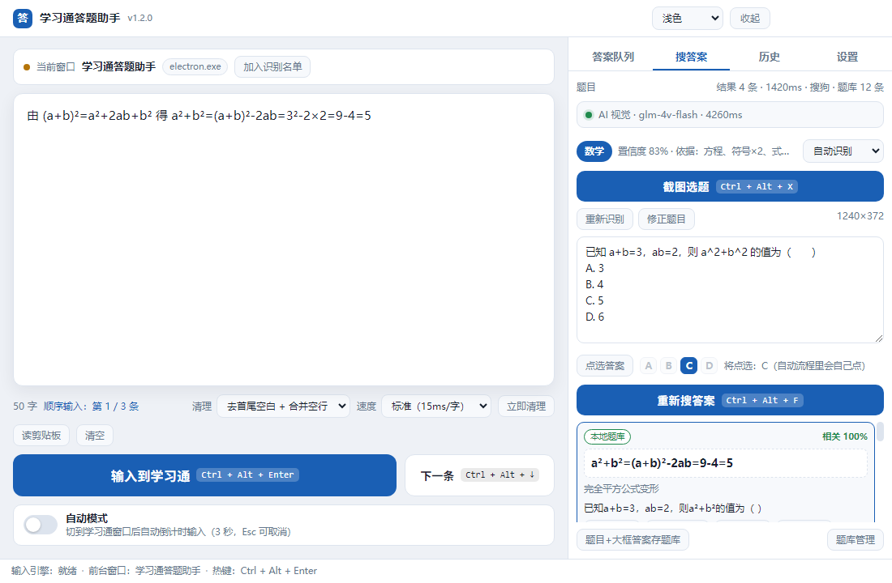
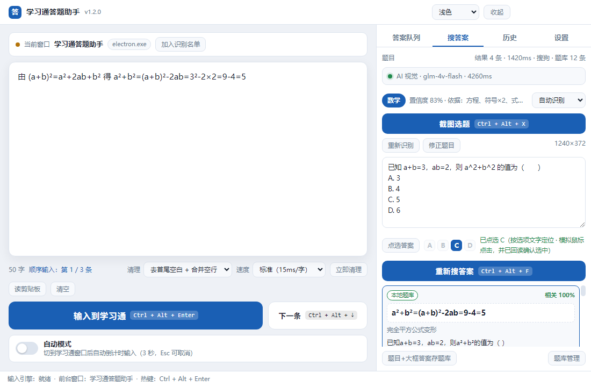
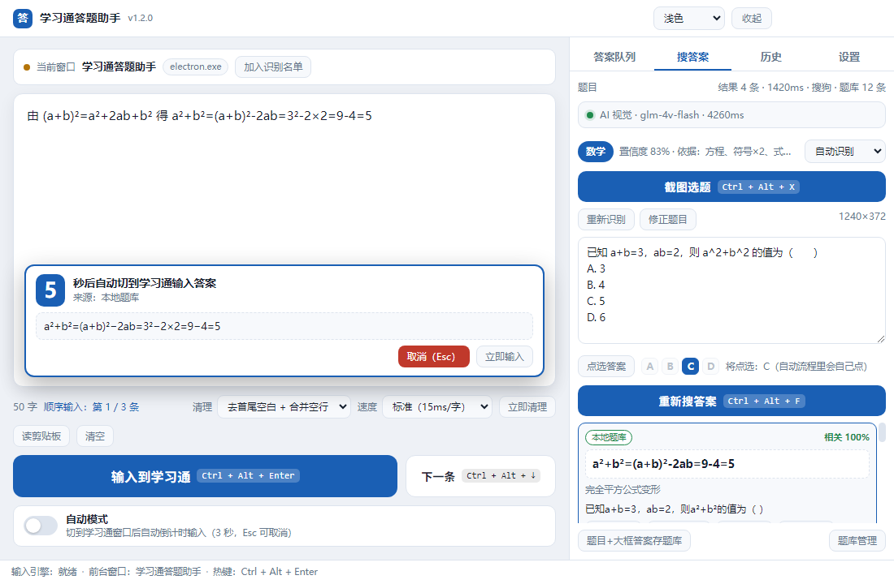
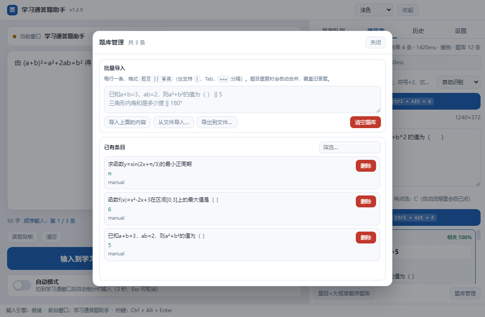

# 学习通答题助手 · StudyAnswerHelper

> 题目是照片？框一下 —— 它认题、判学科、搜答案，选择题直接替你点中选项，其他题型把答案打进去。
>
> Photo of a question? Box it — it reads the question, works out the subject, finds the answer, clicks the right option on multiple-choice, and types the answer otherwise.

**[中文说明](#中文说明) ｜ [English](#english)**



<details open>
<summary><b>其他界面截图（点开看：点选结果 / 识别后自动输入 / 答案队列 / 题库管理 / 历史 / 设置 / 深色主题）</b></summary>

**自动点选选择题** —— 显示识别出的学科与置信度、四个选项里正确答案高亮，点一下（或等自动流程）就替你在学习通里点中它



**识别后自动输入** —— 搜到答案后弹 5 秒倒计时，把将要输入的答案原文先摊给你看，Esc 可取消



**答案队列** —— 大框写答案，按一个热键逐字输入，不碰剪贴板


**题库管理** —— 把标准答案攒起来，下次同题离线秒出；支持批量粘贴导入和 JSON 导入导出



**输入历史** —— 每次成功输入的内容自动留档，可一键回填


**设置** —— 热键、自动模式倒计时、逐字速度、搜答案、图片识别、自动流程、窗口识别名单


**深色主题** —— 跟随系统，或手动切换


</details>

---

## 中文说明

### 这是什么

一句话：**把"复制 → 切窗口 → 点输入框 → 粘贴 → 检查"这一串动作，压缩成"写一次答案 + 按一个键"。**

它的使用场景是：需要把**同一批答案**反复、大量地录入到学习通的答题框里。手工操作时每道题都要重复 5 遍动作，几十道题下来手指和注意力都废了。这个工具把答案先放在一个大输入框里，之后每次只需要按一下热键。

### 和参考项目有什么不同

参考项目 [Z-MiCTrue/Auto_Stuendt](https://github.com/Z-MiCTrue/Auto_Stuendt) 走的是**屏幕截图 + 模板匹配 + 模拟鼠标点击**的路线。这条路线的代价是：

- 要自己准备图标截图放进 `templates/` 文件夹
- 要按自己的屏幕分辨率手改 `params.txt`
- 分辨率或界面样式一变就失效，得重新截图调参

本项目**不靠屏幕识别来定位界面**（不做模板匹配、不模拟点击找按钮），改用两条更稳的路径：

| | 参考项目 | 本项目 |
|---|---|---|
| 定位方式 | 图像模板匹配 | 读窗口标题 / 进程名（Win32 API） |
| 触发方式 | 定时轮询 + 模拟点击 | 全局热键，或切到学习通后自动倒计时 |
| 受分辨率影响 | 会，换屏幕要重调参数 | 不会 |
| 输入中文 / 数学符号 | 靠剪贴板或 `pyautogui` 打字 | `SendInput` + `KEYEVENTF_UNICODE`，√ ≈ π ∫ 等直接送进输入框 |
| 界面 | 改配置文件 | 图形界面，点几下就能用 |

> 补充一句免得误会：**v1.2.0 确实用了屏幕截图，但用途只是"把题目照片读成文字"**。
> 它截的是你亲手框住的那一块，交给识别模型，用完即删。
> 界面元素仍然全靠窗口标题 / 进程名判断，不靠图像匹配 —— 所以换分辨率依然不会失效。

### 功能

- **大输入框**：整个左半屏都是输入区，可以直接 `Ctrl+V` 粘贴整段答案，自动保存草稿（关掉程序也不丢）
- **图片识别题目（v1.2.0 新增）**：`Ctrl + Alt + X` 在屏幕上框住题目照片，自动识别出题干 —— 见下节
- **自动判学科（v1.3.0 新增）**：不只会数学。数学、语文、英语、物理、化学、生物、历史、地理、道德与法治、信息技术都能认，并按该学科的规范作答（数学给步骤、英语给译文、语文给出处、物理化学给公式与配平）—— 见下节
- **自动点选选择题（v1.3.0 新增）**：识别出是选择题并且知道正确答案是哪个字母时，直接在学习通窗口里**替你点中那个选项**（走系统无障碍接口，不靠坐标，换分辨率也不会失效）—— 见下节
- **搜答案（v1.1.0 新增）**：贴一道题进去，三路答案来源同时开工 —— 见下节
- **识别后自动输入（v1.2.0 新增）**：搜到高可信答案后弹 5 秒倒计时，自动切到学习通把答案打进去（秒数可调，整组可关）。**选择题会优先改为"点选选项"而不是打字**
- **全局热键触发**：默认 `Ctrl + Alt + Enter`，在**任何**窗口下都生效，不需要先点回本程序
- **自动模式**：打开开关后，只要切到学习通窗口，倒计时 3 秒就自动输入（按 `Esc` 随时取消）
- **答案队列 + 顺序输入**：把多道题的答案预存成队列，每按一次 `Ctrl + Alt + ↓` 自动装下一条，适合连着一大批题往下录
- **逐字输入**：一个字一个字送进目标输入框，模拟真人打字节奏；速度可调（5～60 ms/字）
- **数学符号完整支持**：基于 `KEYEVENTF_UNICODE`，不走剪贴板，**不会污染你的剪贴板**，`√ ≤ ≥ π ∫ ∑ ∈ ≈ ≠ ° ∠` 都能正确输入
- **内容清理**：一键去掉首尾空白、合并多余空行和行内空格（从别处复制来的答案经常带一堆多余空白）
- **输入历史**：每次成功输入的内容自动记录，随时回填再用；同时也是一个排查问题的凭据
- **窗口识别名单可配置**：默认认「学习通 / 超星 / chaoxing / xuexitong」，如果学校用的是别的客户端，点一下"加入识别名单"把当前窗口加进去就行
- **托盘常驻**：关闭窗口不退出，缩在系统托盘里随时待命；双击托盘图标回来
- **浅色 / 深色主题**，跟随系统

### 图片识别：题目是照片也能做（v1.2.0 新增）

学习通上很多题目是老师拍的照片、扫描件或截图，选不中、复制不了。这一版把这条链路补齐了：

**按 `Ctrl + Alt + X` → 屏幕变暗 → 拖框圈住题目 → 松手**，剩下的它来做。

也可以不记热键：切到右边「搜答案」标签页，点那个蓝色的「截图选题」按钮。

识别有两路：

| 引擎 | 怎么工作 | 需要什么 | 准确率 |
|---|---|---|---|
| **AI 视觉**（默认，推荐） | 把框选的那块图交给视觉模型（默认智谱 `glm-4v-flash`，备选 `deepseek-v4-flash`），它能认公式、上标、根号、分数和 A/B/C/D 选项 | 一个 API Key（智谱 glm-4v-flash 有免费额度） | 数学题可放心用 |
| **Windows 自带 OCR** | 调用系统内置的 `Windows.Media.Ocr`，完全离线 | 什么都不需要 | **认不出数学公式**，只作兜底 |

**关于兜底要说得直白一点**：Windows 自带 OCR 实测会把 `a²` 认成 `a2`、`3²` 认成 `32`、
减号 `−` 认成汉字 `一`，还会整行漏掉 `A.3 B.4` 这样的选项。拿这种文本去搜题基本搜不到。
所以它只是"有字就行、不挑准确率"时的兜底，用它的结果时界面会挂一条黄色警告提醒你。

**题目框现在默认只读。** 它的内容**只有一个来源：识别结果**，不再支持手动键入 ——
这样避免"手输的和图上的对不上"。识别错了就点「修正题目」解锁，改完点「保存修正」。

**识别完可以自动输入**：识别出题目 → 自动搜答案 → 搜到高可信答案后右下角弹 **5 秒倒计时**，
把将要输入的答案原文先摊开给你看一眼，然后自动切到学习通逐字输入。
倒计时期间按 `Esc` 取消，点「立即输入」立刻动手。秒数可调（3 / 5 / 8 / 12 秒），
整个自动流程也能一键关掉（设置 → 识别之后的自动流程）。

### 判学科 + 自动点选选择题（v1.3.0 新增）

**不再只是数学助手。**

识别出题目后，它会用一个**纯本地的词法打分**判断这是哪一科（不联网、不调模型、瞬间出结果），
然后把这门学科的作答规范交给 AI：数学要写步骤、英语要给译文和语法点、语文要给读音/写法/出处、
物理要带单位、化学要配平、历史地理要给史实与成因、信息技术要给术语。

界面上会显示判定的学科和一个**置信度**，还有判断依据（比如"依据：方程、符号×2、式子×2"）。
判断错了？旁边的下拉框可以当场改成正确的学科 —— 它会记住你的选择。
置信度低的时候标签会变成描边样式，提醒你别全信。

支持的学科：`数学 / 语文 / 英语 / 物理 / 化学 / 生物 / 历史 / 地理 / 道德与法治 / 信息技术`，
认不出来时按「通用」处理。

**选择题可以替你点。**

当题目里有 `A. B. C. D.` 选项、且答案能明确落到某个字母上时（例如 `答案：C`），
下方会出现「点选答案」按钮，并把**正确答案那个字母高亮**出来：

- 打开「设置 → 学科与选择题点选 → 选择题：自动点选正确选项」后，
  识别→搜答案→5 秒倒计时结束时会**直接替你点中那个选项**，而不是往输入框里打一个字母
- 想手动来，随时可以点那个按钮
- 多选题（答案形如 `AC`）也支持，会按字母顺序逐个点

**它是怎么点的（这点很重要）**：走 Windows 的 **UI Automation** ——
在目标窗口里找到"名字以 `A.` / `B.` / `C.` / `D.` 开头的可选控件"，然后选中它。
**不依赖坐标**，所以换分辨率、换缩放、页面滚动都不会失效。

失败时它会说清楚原因，而不是假装成功：
- 读不到这个窗口的界面结构 → 会提示你先把学习通切到前台、点一下页面再试
- 找到了选项但点不动 → 会提示页面拦截了程序化操作
- 点选失败会自动**退回"直接输入答案文本"**，并把失败原因写在提示里

> **一个需要知情的边界**：它依赖目标程序向系统暴露界面结构。实测浏览器（Edge）没问题；
> 少数以受限参数启动的 Chromium 客户端可能不暴露，此时会明确报"这个窗口没有暴露界面结构"，
> 请改用浏览器网页版学习通，或改用「输入答案」的方式。

### 搜答案：题目进去，答案出来

学习通上常常只有题目、没有答案。这个功能就是补上这一步：**把题目贴进来，它去帮你找答案，找到就一键填进大框。**

三路答案来源，同时开工，谁先有结果一起汇总排序（也可以单独关掉某一路）：

| 来源 | 怎么工作 | 需要什么 | 特点 |
|---|---|---|---|
| **本地题库** | 和你自己攒的题库做模糊匹配（字符相似度 + 数字特征 + 运算符特征） | 什么都不需要 | 离线、瞬时、**准确率 100%**（答案是你自己录的）。用得越多越好用 |
| **网络检索** | 在搜狗 / 360 / 必应上搜题干，抓取结果页，再从标题摘要里抽取疑似答案 | 需要联网 | 不用配任何 Key。返回的主要是**线索**（题干常常就在结果标题里，点开就能看解析） |
| **AI 解答** | 调一个 OpenAI 兼容接口（DeepSeek / 通义 / Kimi / 智谱 / OpenAI / 本机 Ollama 都行） | 需要一个 API Key | **数学题最靠得住**，会给答案 + 简要解析。不填也能用前两路 |

**怎么用：**

- **题目是文字**：在学习通里选中题目 → `Ctrl+C` 复制 → 按 `Ctrl + Alt + F`（搜题热键）。
  助手会自动跳到前台，拿剪贴板里的题目开搜。
- **题目是图片**：按 `Ctrl + Alt + X` 框选题目（见上一节），识别完它会自动接着搜。

搜到后结果排在右边：**本地题库 `100%`** 的会自动填进大框；网络线索点「打开网页」看原题解析；
AI 的可以「答案+解析」一起填。然后回到学习通，按 `Ctrl + Alt + Enter` 输入 ——
或者干脆等那个 5 秒倒计时自己动手。

不想记热键也行：切到右边「搜答案」标签页，点「截图选题」或「重新搜答案」。

**几个必须说清楚的点：**

- **网络检索抽到的答案会标成「疑似请核对」**，请务必对一下再输入。搜索引擎给的是公开网页上的线索，不是权威答案。
- 搜索引擎短时间内被问太频繁会弹**人机验证页**。程序能识别这种情况，会**自动换下一个引擎**，并在设置页提示哪个引擎正在冷却。真遇到持续失败，隔几分钟再试。
- 觉得某道题的答案靠谱，点「存入题库」，下次这道题就是**离线秒出**了。
- 题库支持批量导入：题库管理 → 粘贴 `题目 || 答案`，一行一条。

### 下载与安装

到本仓库的 [Releases](../../releases) 页面下载，两个文件选一个：

| 文件 | 说明 |
|---|---|
| `StudyAnswerHelper-Setup-1.3.0.exe` | **安装版（推荐）**。双击安装，会建桌面和开始菜单快捷方式，卸载时保留你的答案数据 |
| `StudyAnswerHelper-Portable-1.3.0.exe` | **便携版**。免安装，双击即用，适合放在 U 盘里 |

> **Windows 会弹"已保护你的电脑"（SmartScreen）**
> 这是正常的：本程序没有购买代码签名证书（一年几百到几千元），Windows 对没有签名的程序一律拦一下。
> 点「更多信息」→「仍要运行」即可。源码完全公开在本仓库，可以自己核对、自己编译。

### 快速上手

**题目是照片（最省事）：**

1. 打开程序
2. 按 `Ctrl + Alt + X`，拖框圈住屏幕上的题目，松手
3. 它识别题目 → 搜答案 → 右下角弹 5 秒倒计时
4. 5 秒内切到学习通，**把光标点进答题框** —— 倒计时结束，答案自己一个字一个字输进去

中途不想让它输入，按 `Esc` 取消。

**答案已经在你手上：**

1. 打开程序，把答案写进左边的大框里（或者 `Ctrl+V` 粘贴）
2. 切到学习通，**把光标点进答题框**
3. 按 `Ctrl + Alt + Enter` —— 答案会自己一个字一个字输进去

之后每次只需要改一改大框里的内容，重复第 2、3 步。

### 五个按键

| 按键 | 作用 |
|---|---|
| `Ctrl + Alt + X` | **截图选题**：框选题目照片，自动识别（v1.2.0 新增） |
| `Ctrl + Alt + F` | 按题目重新搜答案（题目来自上次识别结果） |
| `Ctrl + Alt + Enter` | 把大框里的内容输入到学习通 |
| `Ctrl + Alt + ↓` | 切到"下一条"（需要先用答案队列存多条） |
| `Esc` | 取消倒计时 / 关掉弹窗 |

全部可以在「设置」里改。

### 三种触发方式，按习惯挑一个

| 方式 | 怎么用 | 适合 |
|---|---|---|
| **全局热键** | 光标在答题框里，按 `Ctrl + Alt + Enter` | 最常用。人在学习通界面上，手不用离开键盘 |
| **自动模式** | 打开左下角"自动模式"开关，之后只要切到学习通窗口就自动输 | 题目多、要反复切窗口；倒计时期间按 `Esc` 可取消 |
| **点按钮** | 点界面上的「输入到学习通」 | 想先确认一下内容对不对再输 |

### 常见问题

**Q：按热键没反应？**
多半是热键被别的软件占用了（很多截图/输入法软件会占用 `Ctrl+Alt+*`）。到「设置 → 主热键」换一个，界面上会提示是否注册成功。

**Q：程序显示"已输入"，但学习通里什么都没出现？**
最可能的原因是**权限不对等**。Windows 有 UIPI 保护机制：**普通权限的程序无法向以管理员身份运行的窗口发送按键**。
如果你用的是以管理员身份启动的浏览器，或者学习通客户端本身以管理员运行，请把本助手也改成"以管理员身份运行"。

其他可能：
- 光标没有落在答题框里（先点一下答题框）
- 学习通页面还没加载完
- 某些答题框是特殊编辑器（富文本/公式编辑器），对模拟按键不敏感 —— 这种情况把「逐字写入间隔」调大一些（设置里选"很稳（60ms/字）"）通常能解决

**Q：输入的内容被截断了 / 有几个字丢了？**
把「逐字写入间隔」调大。设置为"稳妥（30ms/字）"或"很稳（60ms/字）"。默认 15ms 已经能适配绝大多数答题框，但页面越卡就越需要放慢。

**Q：为什么不用剪贴板粘贴？那样快得多。**
因为剪贴板粘贴会**覆盖你剪贴板里原有的内容**，而且有些答题框对 `paste` 事件做了拦截。逐字输入不会动剪贴板，也最接近真人操作。

**Q：识别不到学习通窗口？**
默认名单是按学习通官方客户端和网页版配的。如果学校用的是定制客户端，切到那个窗口，点界面上「加入识别名单」按钮，把它的标题和进程名加进去即可。

**Q：搜答案搜不到东西？**
按顺序排查：

1. **看右边的错误提示。** 程序会把每一路来源的失败原因原样显示出来，比如"搜狗：触发了人机验证，已自动改用其他来源"。
2. **是不是被搜索引擎限流了。** 一分钟内连搜十几道题，搜狗会弹人机验证页。程序会临时跳过它、自动改用 360 / 必应，设置页会显示哪个引擎在冷却（默认冷却 3 分钟）。
3. **题目识别得对不对。** 如果题目是照片，先确认识别结果 ——
   点「修正题目」把明显错的地方改掉再搜。走 Windows 自带 OCR 时公式基本是错的，
   换 AI 视觉引擎（设置 → 图片识别）。
4. **换个写法。** 题干太长时可以只留关键条件部分；搜狗对"完整题干"最敏感。
5. **配一个 AI 接口**，数学题这一步最稳（见「搜答案」一节的表格）。

**Q：网络检索给的答案是错的 / 不完整？**
网络检索拿的是**公开网页的线索**，不是权威答案。程序只做了两件事：按相关度排序、从标题摘要里抽可能含答案的片段，抽到的都会打上「疑似请核对」标签。**请务必自己看一眼再输入。** 想要稳定的正确答案，请用「本地题库」（自己录）或「AI 解答」。

**Q：识别出来的题目不对（公式变成数字、少了选项）？**
说明当前走的是 **Windows 自带 OCR** —— 它认不出数学公式（界面会有黄色警告）。实测它会把 `a²` 认成 `a2`、`3²` 认成 `32`、减号 `−` 认成汉字 `一`，还会整行漏掉选项。
到「设置 → 图片识别」把引擎改成 **AI 视觉** 并填一个 Key，智谱 `glm-4v-flash` 有免费额度。
另外框大一点、把题干和选项一起圈进去，识别效果更好。

**Q：识别完 5 秒倒计时过去了，学习通里没输入？**
倒计时结束前得让光标落在答题框里。程序会尝试自动切窗口点一下，但有些页面需要你手动点一下答题框。也可以点「立即输入」。
如果连窗口都没切过去，检查「设置 → 自动模式」和「识别之后的自动流程」里的开关。
不想要这个自动流程，可以在设置里整组关掉。

**Q：搜答案联网吗？会上传我的东西吗？**
- **只在「网络检索」打勾时联网**，请求内容只有**题干文本**（会先剔除选项和多余空白），发给搜狗 / 360 / 必应。除此之外不发送任何东西 —— 不会上传你的答案、历史、题库。
- **图片识别用 AI 视觉时会联网**，发出去的**只有你框选的那一块截图**（不是整屏），用完即删临时文件。用 Windows 自带 OCR 则完全不联网。
- **「本地题库」完全离线**，不产生任何网络请求。
- **「AI 解答」只在你填了 Key 并打勾时才调用**，请求内容同样是题干文本 + 一段固定提示词。
- 关掉「网络检索」和「AI 解答」两个勾、识别引擎选 Windows OCR，程序就是纯离线的。

**Q：数据存在哪？**
- 草稿 / 队列 / 历史 / 设置：`%APPDATA%\学习通答题助手\answer-data.json`
- 本地题库：`%APPDATA%\学习通答题助手\answer-bank.json`

都是纯文本 JSON，可以直接看、可以备份。点「设置 → 打开数据文件夹」直接跳过去。卸载时不会删除这两个文件。

> **AI 的 API Key 以明文存在 `answer-data.json` 里**（不加密）。程序只在主进程内使用它，
> **不会把它推给界面进程**（自检里有专门一条断言守着），但它确实躺在你的磁盘上 ——
> 共享这台电脑或导出发送数据文件夹前请留意。不想留就点「设置 → 清除密钥」。

**Q：杀毒软件报毒？**
Electron 应用 + 全局键盘钩子 + 模拟按键，这几个特征叠加起来很容易触发启发式误报。源码全部公开，可自行审计或自行编译（见下文）。

### 技术实现

```
Electron 主进程 ──IPC──> 渲染进程（界面）
      │
      ├── fork 子进程 ──> koffi(FFI) ──> Win32 API
      │                                  ├─ GetForegroundWindow / GetWindowTextW  读前台窗口
      │                                  ├─ QueryFullProcessImageNameW            读进程名
      │                                  └─ SendInput + KEYEVENTF_UNICODE         逐字输入
      │
      ├── lib/answer-search.js ──┬─ lib/answer-bank.js     本地题库（JSON + 模糊匹配）
      │                          ├─ lib/http.js            零依赖 HTTP（搜狗 / 360 / 必应）
      │                          └─ lib/textsim.js         归一化 / 相似度 / 答案解析
      │
      ├── lib/ocr.js ────────────┬─ AI 视觉模型（OpenAI 兼容，主备双模型级联）
      │ （v1.2.0）               └─ lib/ocr-win.ps1         WinRT Windows.Media.Ocr（离线兜底）
      │
      ├── lib/subject.js          学科识别（纯词法打分）+ 选择题与答案字母解析
      │ （v1.3.0）
      │
      └── lib/option-click.js ──── lib/option-click-win.ps1  UI Automation：找选项并选中它
        （v1.3.0）
```

**图片识别链路（v1.2.0）：**

```
Ctrl+Alt+X ──> 隐藏主窗口 ──> desktopCapturer 抓整屏
                              │
                              └─> 全屏无边框遮罩窗口（独立 BrowserWindow，置顶 screen-saver 层）
                                    底图按屏幕真实像素 1:1 摆放，供用户拖框
                                        │
                                  松手 ─┴─> 主进程按 kx/ky 换算裁剪 → 落临时 PNG
                                              │
                                              └─> ocr.js：AI 视觉（主）→ AI 视觉（备）→ 系统 OCR（兜底）
                                                     │
                                        识别文本 ────┴─> 填只读题目框 → 自动搜答案 → 5 秒倒计时自动输入
```

**搜答案的三个技术要点（都是踩过坑才定下来的）：**

- **判"是不是同一道题"不能用普通文本相似度。** 只算字符 bigram 相似度的话，`a+b=3` 和 `a-b=3` 相似度高达 0.87、数字特征还完全一致，会被判成同一道题 —— 数学题里"只差一个符号"恰恰是**完全不同的题**。所以除了 bigram 和数字序列，还加了**运算符特征**，并且设了一条硬规则：归一化后长度相同、差异只有 1~2 个字符、且差异落在运算符或数字上 → 直接判定为不同题。
- **归一化不能删标点。** 普通文本相似度预处理会把标点全去掉，但 `+ - = . / ( ) ² √ π` 在数学题里全是有效信息，删了 `a+b=3` 和 `a-b=3` 会压成同一个串。
- **网页摘要不能整段比对。** 题干十几个字、摘要三四百字，直接比会被摊薄到 0.2 左右，排名就没法看了。所以对"标题""摘要开头""整段"各算一次取最大值 —— 题库站的标题往往就是题干原文。

**零第三方依赖**：HTTP 客户端基于 Node 内置 `http/https/zlib` 自己写（含重定向跟随、超时、gzip/deflate/br 解压、响应体上限）；HTML 解析用正则 + 实体解码，不引 DOM 库；题库就是一个 JSON 文件；图片识别也不用任何 SDK —— 视觉模型直接走 `fetch` 发 base64 图片，系统 OCR 走一段 PowerShell 脚本调 WinRT。整个项目除 `electron` 和 `koffi` 外没有运行时依赖。

**学科识别与自动点选的四个技术要点（v1.3.0）：**

- **学科判断故意不用模型。** 它只是决定"AI 该按哪一科的规范作答"，用错也不会致命，
  所以做成了纯词法打分：关键词分强/弱两级（"解方程"强、"已知"弱）、数学符号、
  以及"代数式"模式（`字母/数字 + 运算符 + 字母/数字`），再加一条语言先验
  （汉字占比高就把"英语"降权）。**不联网、不调模型、瞬间出结果、完全可离线复现**，
  所以它能被自检覆盖。判断错了旁边就有下拉框可改。
- **点选不记坐标，走系统无障碍接口。** 记住"选项在屏幕上的位置"这条路看起来简单，
  但分辨率、缩放、页面滚动、字体大小任何一项变化都会失效。改用 UI Automation
  按语义找元素：名字以 `A.`/`B.`/`C.`/`D.` 开头的可选控件。找到后依次尝试
  `SelectionItemPattern.Select` → `InvokePattern.Invoke` → `TogglePattern.Toggle`，
  都不支持才退化为在该元素中心做一次真实鼠标点击；点完还会**回读确认是否真的选中**。
- **Chromium 系窗口的无障碍树要主动唤醒。** 这类窗口的界面结构是按需构建的，
  第一次查询可能什么也读不到。脚本会先给窗口发 `WM_GETOBJECT` 且
  `lParam = UiaRootObjectId`（用带超时的 `SendMessageTimeoutW`，避免被卡住的目标阻塞），
  再配合重试与全量遍历。实测：不这么做，17 次尝试 12 秒仍然读到 0 个控件。
- **拿不准就不点。** 选项字母匹配不到时，只有在"可选控件数量**恰好等于**选项数"时才按序号兜底；
  对不上就拒绝点选 —— 这道题宁可不点，也不能点错。失败原因会原样告诉用户。

**图片识别的三个技术要点：**

- **系统自带 OCR 对数学题不可用，只能当兜底。** 实测 `a²`→`a2`、`3²`→`32`、减号 `−`→汉字 `一`，还整行漏掉选项。所以主路是 AI 视觉模型，系统 OCR 只在没配 Key 或模型调用失败时兜底，并且**用了它就挂一条黄色警告**，不让人误以为"识别成功了"。
- **PowerShell 5.1 调 WinRT 有两个坑。** 一是 `IAsyncOperation` **不能**用 `.GetAwaiter()`（报"无法对 System.__ComObject 调用方法"），必须用 `AsTask` 反射桥接；二是 `IAsyncOperation\`1` 里的反引号在**双引号字符串**中是转义符会被吃掉，得用单引号。另外 WinRT 的文件 API 不认正斜杠，`$res.Lines` 直接取 `.Count` 会得到空值 —— 这些都在 `ocr-win.ps1` 的注释里标了。
- **框选坐标最容易悄悄错位。** 无边框窗口默认会被"工作区"限制住（实测高度 1040 而不是屏幕的 1080），一旦底图被 CSS 拉伸，"你框的位置"和"实际截到的内容"就错开了 —— 曾经出现"框住题目却识别出任务栏日期"。修法是底图按屏幕真实像素 **1:1** 摆放、`show()` 之后再 `setBounds()` 强制铺满，并且加了一套像素级自检（`SP_CAPTURETEST`，见下）守住它。

**搜索引擎适配**：搜狗（中文题库命中率最高）→ 360（更抗限流，且结果页直接给出真实 URL，不必解跳转）→ 必应（兜底）。依次尝试，第一个能解析出结果的即采用；撞上人机验证页的引擎会被临时冷却并自动跳过。

几个刻意的设计决定：

- **不用 `pyautogui` / `robotjs`**：`koffi` 是预编译的 N-API 模块，装完即用，不需要本机编译工具链，也不受 Node 版本升级影响。
- **逐字输入丢进独立子进程**：`SendInput` 逐字发送时是阻塞的（每个字之间要 sleep），放在主进程会卡死界面。所以单独 fork 一个进程专门干这件事，通过 IPC 通信，界面始终流畅。
- **手写 `INPUT` 结构体而不是用结构体绑定**：`sizeof(INPUT)` 在 x64 下是 40 字节，偏移是固定的。直接按字节写 Buffer 比让 FFI 去做结构体封送更可控，也更快。仓库里的 `tools/probe-koffi.js` 就是这个假设的自检探针。
- **提醒一个真实的坑**：`koffi` 把 `void*` 返回值（比如窗口句柄）返回成 **BigInt**，而 Node 的 IPC 默认用 JSON 序列化，`JSON.stringify(BigInt)` 会**直接抛异常**。如果这个异常被 `try/catch` 吞掉，表现就是"前台窗口永远读不到、输入完成收不到回执"——非常隐蔽。本项目在读取处统一转成 `Number`，并在发送处做了降级兜底。

### 从源码运行 / 构建

需要 Node.js 18+。

```bash
# 1. 安装依赖
npm install

# 2. 开发模式运行
npm start
# 如果启动失败（沙箱/GPU 环境受限），用：
npm run start:safe

# 3. 生成图标（改过 tools/make-icons.js 之后执行）
npm run icons

# 4. 生成一张"像照片"的示例题目图，用来离线验证识别链路
node tools/make-question-image.js

# 5. 打包成 exe（产物在 dist-installer-v5/）
npm run build
```

国内网络建议先设镜像（`.npmrc` 已经配好了）：

```bash
npm config set registry https://registry.npmmirror.com
```

> 重复打包时建议换一个输出目录，免得清理旧目录失败：
> `npx electron-builder --win --config.directories.output=dist-installer-v6`
>
> **如果构建报 `unable to verify the first certificate`**：说明你的网络里有 HTTPS 代理在做
> TLS 中间人（常见于公司网络）。`curl -k` 能正常下载就说明内容没问题。此时可以：
> `NODE_TLS_REJECT_UNAUTHORIZED=0 npx electron-builder --win`
> （只在你信任本机网络的前提下这么做）
>
> 另外注意：`--dir` 只生成 `win-unpacked`、**不会**产出安装包；要出 Setup/Portable 必须用
> `--win`，且首次需要联网下载 winCodeSign（约 2.5 MB）。

### 上传到你自己的 GitHub 仓库

`release/` 目录里就是打包好的成品，三种上传方式任选。

**先看清楚这条**：GitHub 对单个文件有两条硬规定 —— 超过 **50 MB** 会警告，超过 **100 MB** 直接拒绝。本项目两个 exe 各约 **76 MB**，能提交上去，但仓库会变得很重，而且以后每次改代码重新提交都会在历史里再存一份。

**方式一：源码走仓库 + 二进制走 Releases（推荐）**

仓库里只放源码，exe 作为 Release 附件发布，不占仓库体积，下载体验也更好：

```bash
git init
git add .
git commit -m "学习通答题助手 v1.3.0：源码"
git branch -M main
git remote add origin https://github.com/<你的用户名>/<仓库名>.git
git push -u origin main

# 再发布 Release（需要先安装 GitHub CLI：https://cli.github.com/）
gh release create v1.3.0 \
  "release/StudyAnswerHelper-Setup-1.3.0.exe" \
  "release/StudyAnswerHelper-Portable-1.3.0.exe" \
  "release/使用说明.txt" \
  --title "学习通答题助手 v1.3.0" \
  --notes "新增学科识别与选择题自动点选"
```

README 里的下载链接用的是相对路径 `../../releases`，所以走 Releases 时链接直接就通。

**方式二：exe 也一起提交（简单，但仓库会变重）**

默认 `.gitignore` 里已经忽略了 `release/`，所以要先把它那一行删掉，exe 才会被纳入：

```bash
# 先删掉 .gitignore 里 "release/" 这一行
git init
git add .            # 删掉那行之后，exe 才会被一起提交
git commit -m "学习通答题助手 v1.3.0（含 exe）"
git branch -M main
git remote add origin https://github.com/<你的用户名>/<仓库名>.git
git push -u origin main
```

> 如果 push 时报 `this exceeds GitHub's file size limit of 100 MB`，说明文件太大，改用方式一。
> 如果 push 很慢或失败，多半是网络问题，可以配代理：
> `git config --global http.proxy http://127.0.0.1:7890`

**方式三：两个都要**

仓库里放源码 + 一份 exe，同时再发一个 Release。适合想让别人 clone 下来就能直接用的场景。

### 自动化自检

这个项目配了五套自动验证，改完代码建议跑一遍：

| 环境变量 | 作用 |
|---|---|
| `SP_SELFTEST=1` | **交互级自检**：在真实渲染进程里断言 39 项，包括用 `elementFromPoint` 验证"按钮是不是真的点得到"（程序化 `click()` 会绕过层级遮挡判定，掩盖真实缺陷）、搜答案的离线闭环、识别结果渲染与只读态、自动输入浮层、题库弹窗、以及"两把 API Key 都不许出主进程"的安全断言 |
| `SP_SMOKE=1` | **真实键盘注入**：开一个标题为「学习通」的测试窗口，用真正的 `SendInput` 把 `数学答案：√3 + 1/2 ≈ 1.366` 打进去，再读回来逐字比对 |
| `SP_SHOT=1` | **界面截图走查**：把六个页面 × 两套主题截成 PNG 放到 `preview/`（用现造的演示数据，不会截进真实答案） |
| `SP_SEARCHTEST=1` | **真实检索链路**：联网实跑一次三源检索，把候选与错误原样写进日志。**故意和自检分开** —— 自检必须离线可复现，而这条链路依赖外部搜索引擎 |
| `SP_CAPTURETEST=1` | **真实识别链路**：真开一次全屏框选遮罩，走完"截图 → 裁剪 → 识别 → 落盘"。加 `SP_CAPTURE_KEEP=x.png` 会把遮罩画面和裁剪结果各存一份，方便人工核对 |
| `SP_CLICKTEST=1` | **真实点选链路**：开一个带真实单选按钮的原生窗口，让 UI Automation 去点，再从目标窗口**读回**到底选中了没有。同时验证"名称里没有选项字母时拒绝点选""选项数不符时拒绝点选" |

v1.1.0 打包产物的实测结果（开发态与打包后的 exe 各跑一遍，结果一致）：

```
SP_SELFTEST   32 项通过 / 0 项失败 / 0 个渲染层 JS 错误
SP_SMOKE       5 项通过 / 0 项失败
              窗口识别命中 → 键盘注入完全一致（21 字 / 451 ms）
SP_SEARCHTEST 本地题库命中 1.000 并自动填入大框；搜狗返回 9 条线索，头名相关度 0.905
```

v1.2.0 的实测结果（开发态、打包版 `win-unpacked` 与便携版三处各跑一遍）：

```
SP_SELFTEST     39 项通过 / 0 项失败 / 0 个渲染层 JS 错误
SP_SMOKE         5 项通过 / 0 项失败，键盘注入 21 字逐字一致（450~459 ms）
SP_SHOT          6 个页面 × 2 套主题
SP_CAPTURETEST   遮罩窗口 1920×1080 == 屏幕；底图 1:1 未被拉伸；
                 裁剪尺寸 960×324 == 选区换算值；
                 裁剪内容与选区内容 16×16 逐字节完全一致（差值位置 = -1）；
                 识别文本成功落盘；遮罩关闭、主窗口恢复
```

> `SP_CAPTURETEST` 里那条像素比对是**故意在"关掉放大"的前提下**做的：
> 开启放大时用的是高质量插值，放大图每个像素都是邻域混合值，逐字节比必然差几个色阶。
> 关掉放大再比，才是"框哪裁哪"的硬证明 —— 改截图相关代码后务必重跑它。

v1.3.0 的实测结果（开发态）：

```
SP_SELFTEST     49 项通过 / 0 项失败 / 0 个渲染层 JS 错误
SP_SMOKE         5 项通过 / 0 项失败
SP_SHOT          7 个页面 × 2 套主题，含新增 main-choice-picked.png
SP_CLICKTEST     6 项通过 / 0 项失败：
                 按选项文字定位 → 真的点中，并从目标窗口读回确认选中了 C
                 名称里没有选项字母 → 拒绝点选，目标窗口确认没有被误选
                 选项数与实际可选控件数不符 → 拒绝点选
                 无效句柄 → 如实失败并给出可操作提示
```

> **`SP_CLICKTEST` 覆盖什么、不覆盖什么**：它验证的是**匹配与调用逻辑**（找元素 → 选中 → 回读确认）。
> 它不验证"真实浏览器页面里的选项"，因为这个测试环境的沙箱 Electron 窗口不暴露无障碍树
> （实测只暴露 `Chrome Legacy Window` 桩节点，真实 Edge 窗口则返回 1138 个元素）。
> 另一条"按序号兜底"的路径需要真正的 `RadioButton` 类型控件才会触发，本机 WinForms 窗口的
> 单选按钮被系统桥接成 `Pane`，所以那条路径**在本机未被覆盖** —— 它的设计是"数量不符就拒绝"。

```bash
# Windows / PowerShell
$env:ELECTRON_RUN_AS_NODE = $null      # 必须清掉，否则 electron 会以纯 Node 模式启动
$env:SP_SMOKE_LOG = "$PWD\_smoke.log"  # 让日志落到文件（部分终端拿不到 stdout）
$env:SP_SMOKE = "1"
.\node_modules\electron\dist\electron.exe . --no-sandbox --disable-gpu
```

### 数据与隐私

- **默认完全离线**。程序只在「搜索答案 → 网络检索 / AI 解答」打勾、或识别引擎选了 AI 视觉时才联网。
- 联网时发出去的内容只有两样：
  - 搜题：**题干文本**（会先剔除 `A. B. C. D.` 选项和多余空白）→ 搜狗 / 360 / 必应
  - 图片识别：**你框选的那一块截图**（不是整屏）→ 你配置的视觉模型接口
- 你的答案、题库、历史只存在本机：
  - `%APPDATA%\学习通答题助手\answer-data.json`（草稿 / 队列 / 历史 / 设置）
  - `%APPDATA%\学习通答题助手\answer-bank.json`（本地题库）
- 没有埋点、没有账号体系、不做任何遥测。
- **截图只在你主动按 `Ctrl + Alt + X`（或点「截图选题」）时发生**，只截这一张，识别完即删临时文件。平时不读屏幕内容、不截屏、不记录按键。
- 只读取前台窗口的**标题和进程名**用于判断"是不是学习通"，不读取窗口内容。
- 剪贴板**只在两个地方被读取**：你主动点「读剪贴板」按钮，或按搜题热键。其余时间一律不碰。
- API Key（AI 解答的、图片识别的）以明文存在 `answer-data.json` 里，且**只在主进程内使用**（自检里有专门断言：状态推送到界面前必须脱敏，两把 Key 都不许外泄）。共享电脑或导出发送数据文件夹前请留意，不想留就点「清除密钥」。

### 免责声明

本工具的作用是**减少重复性的手工录入操作**，不绕过任何考试或作业机制。

v1.1.0 起它还能帮你**检索题目答案**，但检索结果来自公开网页，或来自你自己配置的 AI 模型 ——
**只是参考线索，不保证正确**。程序会把从网页抽到的答案标成「疑似请核对」，
请务必自行判断后再录入。**它替代的是你的手和你的检索动作，不是你的判断。**

请在你**有权录入内容**的场景下使用（例如教师录入标准答案、录入自己已完成的答案、整理教学材料）。请遵守你所在学校关于学习平台的使用规定。使用者需自行承担因使用不当而产生的全部后果。

### 开源协议

[MIT](LICENSE)

---

## English

### What it is

**It compresses "copy → switch window → click the field → paste → verify" into "write the answer once, then press one key".**

The use case: repeatedly entering the same set of answers into Xuexitong (Chaoxing) answer fields, at volume. Done by hand that is five actions per question — across dozens of questions your hands and your attention are gone. This tool keeps the answer in one large text box, and after that each entry costs a single keystroke.

### How it differs from the reference project

The reference project [Z-MiCTrue/Auto_Stuendt](https://github.com/Z-MiCTrue/Auto_Stuendt) uses **screenshot templates plus template matching and synthetic mouse clicks**. The cost of that approach:

- You must capture icon screenshots yourself and drop them into `templates/`
- You must hand-edit `params.txt` for your own screen resolution
- Change the resolution or a UI style and it breaks until you re-tune everything

This project **does not use screen recognition to locate UI elements** (no template matching, no synthetic clicking to find buttons). It takes two sturdier routes instead:

| | Reference project | This project |
|---|---|---|
| Targeting | Image template matching | Window title / process name via Win32 API |
| Trigger | Timed polling + synthetic clicks | Global hotkey, or a countdown after switching to Xuexitong |
| Resolution sensitive | Yes, retune per screen | No |
| CJK / math symbols | Clipboard or `pyautogui` typing | `SendInput` + `KEYEVENTF_UNICODE` — `√ ≈ π ∫` go straight into the field |
| Interface | Edit a config file | GUI, a few clicks |

> To avoid a misunderstanding: **v1.2.0 does use screen capture, but only to read a question photo into text.**
> It captures just the region you draw by hand, hands it to an OCR model, and deletes it. UI elements are still
> located purely by window title / process name, so changing resolution still cannot break it.

### Features

- **Large input box** — half the window is the input area. Paste a whole answer with `Ctrl+V`; the draft is auto-saved and survives a restart.
- **Photo questions (new in v1.2.0)** — press `Ctrl + Alt + X` and drag a box around a question on screen; it reads the question text. See the next section.
- **Subject detection (new in v1.3.0)** — not just maths. It recognises maths, Chinese, English, physics, chemistry, biology, history, geography, civics and IT, and answers each in that subject's idiom. See below.
- **Automatic option clicking (new in v1.3.0)** — when the question is multiple-choice and the correct letter is known, it clicks that option in Xuexitong for you (via the Windows accessibility API, not screen coordinates, so resolution changes cannot break it). See below.
- **Answer search (new in v1.1.0)** — paste a question, and three answer sources fire at once. See below.
- **Auto-enter after recognition (new in v1.2.0)** — once a high-confidence answer is found, a 5-second countdown starts and it switches to Xuexitong and types it (interval configurable, whole flow can be turned off).
- **Global hotkey** — default `Ctrl + Alt + Enter`, works from **any** window, no need to click back into this app first.
- **Auto mode** — flip the switch and simply switching to the Xuexitong window starts a 3-second countdown and then types. Press `Esc` to cancel.
- **Answer queue with sequential entry** — pre-store answers for many questions; each press of `Ctrl + Alt + ↓` loads the next one. Built for working through a long list.
- **Character-by-character typing** at a human-like pace. Speed is adjustable (5–60 ms per character).
- **Full math symbol support** — built on `KEYEVENTF_UNICODE` rather than the clipboard, so it **never clobbers your clipboard**, and `√ ≤ ≥ π ∫ ∑ ∈ ≈ ≠ ° ∠` all arrive intact.
- **Text cleanup** — one click to trim leading/trailing whitespace and collapse redundant blank lines and inline spaces (pasted answers are usually full of stray whitespace).
- **Input history** — every successful insertion is recorded and can be refilled with one click. It doubles as a diagnostic trail.
- **Configurable window matching** — defaults to `学习通 / 超星 / chaoxing / xuexitong`. Using a different client? Switch to its window and click "Add current window to match list".
- **Lives in the tray** — closing the window keeps the app running in the system tray; double-click the tray icon to bring it back.
- **Light / dark theme**, following the system setting.

### Photo questions: box it, read it (new in v1.2.0)

Many questions on Xuexitong are photos, scans or screenshots — you cannot select or copy them. This version closes that gap:

**Press `Ctrl + Alt + X` → the screen dims → drag a box around the question → release.** The rest is automatic.

(No hotkey needed either: open the "搜答案" tab and click the blue "截图选题" button.)

Two engines:

| Engine | How it works | Requirements | Accuracy |
|---|---|---|---|
| **AI vision** (default, recommended) | Sends the region you boxed to a vision model (default Zhipu `glm-4v-flash`, fallback `deepseek-v4-flash`). Handles formulas, superscripts, radicals, fractions and A/B/C/D options | One API key (Zhipu's `glm-4v-flash` has a free tier) | Good enough for maths |
| **Windows built-in OCR** | Calls `Windows.Media.Ocr`. Fully offline | Nothing | **Cannot read maths notation** — fallback only |

**Straight talk about the fallback**: Windows built-in OCR turned `a²` into `a2`, `3²` into `32`, the minus sign `−`
into the Chinese character `一`, and dropped the whole `A.3 B.4` line in testing. Searching with that text finds nothing.
So it is only for "any text will do" situations, and the UI shows a yellow warning whenever it is used.

**The question box is now read-only by default.** Its content has exactly one source — the recognition result —
so manual typing is gone. That prevents "what you typed" from drifting away from "what the photo said".
If it got something wrong, click "修正题目" to unlock, edit, then "保存修正".

**Recognition can feed straight into auto-entry**: recognise → search → once a high-confidence answer is found a
**5-second countdown** appears in the corner, showing the exact answer text it is about to type. Press `Esc` to cancel,
or click "立即输入" to go now. The interval is configurable (3 / 5 / 8 / 12 s) and the whole flow can be switched off.

### Subject detection + automatic option clicking (new in v1.3.0)

**No longer a maths-only helper.**

After reading the question it classifies the subject with a **purely local keyword score** — no network,
no model call, instant — and then hands that subject's conventions to the AI: maths gets worked steps,
English gets a translation and the grammar point, Chinese gets readings/writings/sources, physics gets
units, chemistry gets balanced equations, history and geography get facts and causes.

The UI shows the detected subject plus a **confidence** and the evidence behind it
(the labels are Chinese, e.g. `置信度 83% · 依据：方程、符号×2`). Pick the wrong subject?
Change it right there in the dropdown and it remembers.
Low confidence renders the chip as an outline, so you know not to trust it.

Subjects: `maths / Chinese / English / physics / chemistry / biology / history / geography / civics / IT`,
falling back to "general".

**Multiple-choice questions get clicked for you.**

When the question has `A. B. C. D.` options and the answer resolves to a letter (e.g. `答案：C`),
an "点选答案" button appears and the **correct letter is highlighted**:

- With "选择题：自动点选正确选项" enabled in Settings, the 5-second countdown ends by
  **clicking that option directly** instead of typing a letter into the field
- You can also click the button manually at any time
- Multi-select answers (`AC`) are supported — it clicks each letter in order

**How it clicks — this part matters**: it uses Windows **UI Automation** to find the selectable control
whose name starts with `A.` / `B.` / `C.` / `D.` and selects it. **No screen coordinates**, so resolution,
DPI scaling and page scrolling cannot break it. After clicking it **reads the state back** to confirm.

Failures are reported honestly rather than faked: unreadable window structure, not-yet-rendered page,
or a page that blocks programmatic selection. If clicking fails it **falls back to typing the answer text**
and says why.

> **One boundary worth knowing**: this relies on the target program exposing its UI structure.
> A real browser (Edge) does — measured. A few Chromium clients started with restrictive flags do not,
> in which case the tool says exactly that and you should use the browser version of Xuexitong
> or keep using the "type the answer" mode.

### Answer search: question in, answer out

Xuexitong assignments frequently contain questions but no answers. This closes that gap: **paste the question, it goes and finds the answer, and one click puts it in the big box.**

Three sources run concurrently; results are merged and ranked together (each can be switched off individually):

| Source | How it works | Requirements | Notes |
|---|---|---|---|
| **Local bank** | Fuzzy-matches against a question bank you build up (character similarity + numeric features + operator features) | Nothing | Offline, instant, **100% accurate** — because you entered the answers. Gets better the more you use it. |
| **Web search** | Searches Sogou / 360 / Bing for the question text, fetches the result pages and extracts candidate answers | Internet | No API key needed. Mostly returns **leads** — the question text is often right there in the result title, click through for the worked solution. |
| **AI answer** | Calls any OpenAI-compatible endpoint (DeepSeek / Qwen / Kimi / Zhipu / OpenAI / local Ollama) | Your own API key | **Most reliable for maths.** Returns the answer plus brief working. Optional. |

**How to use it:**

- **Text question**: select it in Xuexitong → `Ctrl+C` → press `Ctrl + Alt + F`. The helper comes to the front and searches the clipboard.
- **Photo question**: press `Ctrl + Alt + X` and box it (see the section above); searching continues automatically.

Results appear on the right: a `100%` local-bank hit fills the box automatically; web leads have an "Open page" button;
AI results can be inserted as "answer + working". Then either switch back to Xuexitong and press `Ctrl + Alt + Enter`,
or just let the 5-second countdown do it for you.

**Things you should know:**

- **Answers extracted from the web are labelled "疑似请核对" (suspected — please verify).** Always check them. A search engine returns leads from public pages, not authoritative answers.
- Search engines rate-limit. Ask too many questions in a minute and Sogou serves a CAPTCHA. The app detects this, **automatically falls back to the next engine**, and shows which engine is cooling down on the Settings page.
- Happy with an answer? Click "存入题库" and that question becomes an instant offline hit next time.
- The bank supports bulk import: Bank management → paste `question || answer`, one per line.

### Download and install

Grab one of the two files from this repository's [Releases](../../releases) page:

| File | Description |
|---|---|
| `StudyAnswerHelper-Setup-1.3.0.exe` | **Installer (recommended).** Creates desktop and Start Menu shortcuts. Your answer data is kept when you uninstall. |
| `StudyAnswerHelper-Portable-1.3.0.exe` | **Portable.** No installation, run it straight from a USB stick. |

> **Windows SmartScreen will warn you.** This is expected: the app is not code-signed (a certificate costs hundreds to thousands per year), and Windows blocks unsigned binaries by default. Click "More info" → "Run anyway". The full source is in this repository — audit it, or build it yourself.

### Quick start

**The question is a photo (easiest):**

1. Open the app.
2. Press `Ctrl + Alt + X` and drag a box around the question on screen. Release.
3. It reads the question → searches → a 5-second countdown appears.
4. Switch to Xuexitong and **click the caret into the answer field** — when the countdown ends the answer types itself in.

Press `Esc` at any point to cancel.

**You already have the answer:**

1. Open the app and write your answer into the large box on the left (or paste with `Ctrl+V`).
2. Switch to Xuexitong and **click the caret into the answer field**.
3. Press `Ctrl + Alt + Enter` — the answer types itself in, character by character.

Afterwards just edit the box and repeat steps 2–3.

### Five keys

| Key | Action |
|---|---|
| `Ctrl + Alt + X` | **Box a question photo** on screen and recognise it (new in v1.2.0) |
| `Ctrl + Alt + F` | Search again using the current question |
| `Ctrl + Alt + Enter` | Type the contents of the big box into Xuexitong |
| `Ctrl + Alt + ↓` | Load the "next" queued answer |
| `Esc` | Cancel the countdown / close a dialog |

All rebindable in Settings.

### Three ways to trigger it

| Method | How | Best for |
|---|---|---|
| **Global hotkey** | With the caret in the answer field, press `Ctrl + Alt + Enter` | The everyday case — you stay on the Xuexitong screen, hands never leave the keyboard |
| **Auto mode** | Flip "Auto mode" on; from then on switching to the Xuexitong window types automatically | Long question lists and constant window switching. `Esc` cancels during the countdown |
| **Button** | Click "输入到学习通" in the UI | When you want to eyeball the content first |

### FAQ

**The hotkey does nothing.**
Most likely another app already owns it (screenshot and IME utilities love `Ctrl+Alt+*`). Change it under Settings → Main hotkey. The UI tells you whether registration succeeded.

**The app says it typed, but nothing appears in Xuexitong.**
Most likely an **integrity-level mismatch**. Windows enforces UIPI: **a normal-privilege process cannot send keystrokes to a window running elevated.** If your browser or the Xuexitong client runs as administrator, run this helper as administrator too.

Other possibilities: the caret is not in the answer field (click it first); the page has not finished loading; or the field is a rich-text/formula editor that ignores synthetic keys — in that case raise the typing interval to "稳妥 (30 ms)" or "很稳 (60 ms)".

**Typed text is truncated or some characters are missing.**
Raise the typing interval. 15 ms handles the vast majority of fields, but the laggier the page, the slower you should go. Settings → 逐字写入间隔.

**Why not just paste from the clipboard? It is far faster.**
Clipboard pasting **overwrites whatever was in your clipboard**, and many answer fields intercept the `paste` event. Character-by-character input touches nothing and is the closest thing to a human at the keyboard.

**It does not recognise my Xuexitong window.**
The default list covers the official client and web version. For a school-specific client, switch to that window and click "Add current window to match list".

**Answer search returns nothing.**
Work through these in order:

1. **Read the error messages on the right.** Every source reports its own failure verbatim, e.g. "搜狗：触发了人机验证（短时间内检索太频繁），已自动改用其他来源".
2. **You may be rate-limited.** A dozen searches in a minute gets you a CAPTCHA from Sogou. The app temporarily skips it and falls back to 360 / Bing; the Settings page shows which engine is cooling down (3 minutes by default).
3. **Was the question recognised correctly?** For a photo question, check the recognised text first — click "修正题目", fix the obvious errors, then search again. On Windows built-in OCR the maths is essentially always wrong, so switch to the AI vision engine (Settings → 图片识别).
4. **Rephrase.** For a very long question, keep only the key conditions; Sogou is most sensitive to the full text.
5. **Configure an AI endpoint** — the most reliable route for maths (see the table above).

**The answer from web search is wrong or incomplete.**
Web search returns **leads from public pages**, not authoritative answers. The app only ranks them by relevance and extracts candidate snippets, and every extracted answer is tagged "疑似请核对". **Always eyeball it before inserting.** For dependable answers use the local bank (your own entries) or the AI source.

**The recognised question is wrong (formulas turned into digits, options missing).**
That means the **Windows built-in OCR** engine is in use — it cannot read maths notation (the UI shows a yellow warning). In testing it turned `a²` into `a2`, `3²` into `32`, the minus sign `−` into the Chinese character `一`, and dropped whole option lines.
Go to Settings → 图片识别, switch the engine to **AI vision** and enter a key (Zhipu `glm-4v-flash` has a free tier). Drawing a bigger box that includes the options also helps.

**The 5-second countdown finished but nothing was typed.**
The caret must be in the answer field when the countdown ends. The app tries to switch windows and click for you, but some pages need a manual click into the field. You can also click "立即输入". If the window never switched at all, check Settings → 自动模式 and 识别之后的自动流程. The whole flow can be switched off there.

**Does answer search send anything out?**
- It only goes online when **Web search** or **AI answer** is ticked, or when the OCR engine is set to **AI vision**.
- What is sent: the **question text** (options and redundant whitespace stripped) → Sogou / 360 / Bing; and for photo questions, **only the region you boxed** (never the full screen) → the vision endpoint you configured.
- It never uploads your answers, history, or bank.
- The **local bank is fully offline** and makes no network requests at all.
- Untick both boxes and set OCR to Windows built-in, and the app is entirely offline.
- **Screen capture happens only when you press `Ctrl + Alt + X`** (or click "截图选题") — one shot, deleted right after recognition. It does not read the screen at other times.

**Where is my data?**
- Draft / queue / history / settings: `%APPDATA%\学习通答题助手\answer-data.json`
- Local question bank: `%APPDATA%\学习通答题助手\answer-bank.json`

Both are plain JSON — readable and backup-friendly. Settings → "Open data folder" jumps there. Uninstalling keeps them.

> **The AI API key is stored in plain text inside `answer-data.json`** (unencrypted). It is only ever
> used in the main process and is **never forwarded to the renderer** (a dedicated self-test assertion
> guards this), but it does sit on your disk — keep that in mind on a shared machine or before sharing
> your data folder. Use "Clear key" to remove it.

**My antivirus flags it.**
An Electron app plus global keyboard hooks plus synthetic input is a textbook combination for heuristic false positives. The source is entirely open — audit it, or build it yourself.

### How it works

```
Electron main process ──IPC──> renderer (UI)
      │
      ├── fork child process ──> koffi (FFI) ──> Win32 API
      │                                           ├─ GetForegroundWindow / GetWindowTextW  read foreground window
      │                                           ├─ QueryFullProcessImageNameW            read process name
      │                                           └─ SendInput + KEYEVENTF_UNICODE         type characters
      │
      ├── lib/answer-search.js ──┬─ lib/answer-bank.js     local question bank (JSON + fuzzy match)
      │                          ├─ lib/http.js            zero-dep HTTP (Sogou / 360 / Bing)
      │                          └─ lib/textsim.js         normalisation / similarity / answer extraction
      │
      └── lib/ocr.js ────────────┬─ AI vision model (OpenAI-compatible, primary/fallback cascade)
        (v1.2.0)                 └─ lib/ocr-win.ps1        WinRT Windows.Media.Ocr (offline fallback)
```

**Three things that shaped the search implementation:**

- **You cannot compare maths questions with plain text similarity.** Pure character-bigram similarity rates `a+b=3` and `a-b=3` at 0.87 with identical numeric features, so one gets mistaken for the other — and in maths, "one symbol different" *is a different question*. So on top of bigrams and number sequences there is an **operator feature**, plus a hard rule: same normalised length, differing in only 1–2 characters, and those characters are operators or digits → treat as different questions.
- **Normalisation must not strip punctuation.** Text similarity pipelines usually drop all punctuation, but `+ - = . / ( ) ² √ π` are all meaningful in maths; strip them and `a+b=3` and `a-b=3` collapse into the same string.
- **You cannot compare a question against a whole snippet.** The question is a dozen characters, the snippet three or four hundred; direct comparison dilutes the score to around 0.2 and ranking becomes useless. So the title, the snippet head, and the full blob are each scored, and the maximum is taken — question-bank pages usually put the question verbatim in the title.

**Zero third-party runtime dependencies**: the HTTP client is written against Node's built-in `http/https/zlib` (redirects, timeouts, gzip/deflate/br decompression, response size cap); HTML parsing is regex plus entity decoding, no DOM library; the question bank is a single JSON file; and image recognition uses no SDK either — the vision model is called with `fetch` and a base64 image, and the built-in OCR path is a PowerShell script over WinRT. Apart from `electron` and `koffi`, there is nothing else.

**Three notes on the recognition pipeline:**

- **Windows built-in OCR is unusable for maths, so it is fallback only.** In testing `a²`→`a2`, `3²`→`32`, minus `−`→the Chinese character `一`, and whole option lines went missing. Hence AI vision is the primary path; the built-in engine only runs when no key is configured or the model call fails — and the UI shows a yellow warning whenever it is used, so nobody mistakes it for a good result.
- **Calling WinRT from PowerShell 5.1 has two traps.** First, `.GetAwaiter()` **does not work** on `IAsyncOperation` ("cannot call a method on System.__ComObject") — you must bridge with `AsTask` reflection. Second, the backtick in `IAsyncOperation\`1` is an escape character inside **double-quoted** strings and gets eaten, so single quotes are required. WinRT's file APIs also reject forward slashes, and `$res.Lines.Count` silently yields nothing — use `@($res.Lines).Count`. All of this is annotated in `ocr-win.ps1`.
- **Selection coordinates are the easiest thing to break silently.** A frameless window is implicitly constrained to the *work area* (measured height 1040 instead of the screen's 1080). If the background image then gets stretched by CSS, "where you drew the box" and "what actually got cropped" diverge — we once boxed a question and got the taskbar clock. The fix is to lay the background out at exact **1:1** screen pixels and force `setBounds()` after `show()`, plus a pixel-level self-test (`SP_CAPTURETEST`) to guard it.

**Search engine adapters**: Sogou (best hit rate for Chinese question banks) → 360 (more resilient, and its result pages expose the real URL directly, no redirect to resolve) → Bing (fallback). They are tried in order and the first one that yields parseable results wins; any engine that serves a CAPTCHA page is put on a cooldown and skipped.

A few deliberate choices:

- **Not `pyautogui` / `robotjs`.** `koffi` ships prebuilt N-API binaries: install and go, no local toolchain, no breakage on Node upgrades.
- **Typing runs in a separate child process.** `SendInput` with a per-character delay blocks, which would freeze the UI if it ran in the main process. So it lives in its own forked process and talks over IPC; the UI stays responsive.
- **The `INPUT` struct is hand-packed rather than FFI-marshalled.** `sizeof(INPUT)` is 40 bytes on x64 with fixed offsets; writing the buffer directly is more predictable and faster. `tools/probe-koffi.js` is the probe that verifies those assumptions.
- **One real trap worth knowing:** `koffi` returns `void*` values (window handles) as **BigInt**, and Node's IPC serializer uses JSON, where `JSON.stringify(BigInt)` **throws**. Swallowed by a `try/catch`, the symptom is "foreground window never detected, insertion receipt never arrives" — extremely hard to spot. This project normalises to `Number` at the read site and adds a fallback at the send site.

### Build from source

Requires Node.js 18+.

```bash
npm install          # install dependencies
npm start            # run in development
npm run start:safe   # if the sandboxed/GPU-restricted environment fails to start
npm run icons        # regenerate icons after editing tools/make-icons.js
node tools/make-question-image.js   # generate a photo-like sample question for offline OCR tests
npm run build        # package into an exe (output in dist-installer-v5/)
```

> For repeat builds, use a fresh output directory to avoid a failed cleanup of the old one:
> `npx electron-builder --win --config.directories.output=dist-installer-v6`
>
> **If the build fails with `unable to verify the first certificate`**, your network has an HTTPS proxy
> doing TLS interception (common on corporate networks). If `curl -k` downloads fine, the content is
> fine — the certificate chain just is not trusted. Workaround:
> `NODE_TLS_REJECT_UNAUTHORIZED=0 npx electron-builder --win`
> (only do this if you trust the local network.)
>
> Also note: `--dir` only produces `win-unpacked` and does **not** build an installer. Setup/Portable
> require `--win`, and the first such build needs to download winCodeSign (~2.5 MB).

### Publishing to your own GitHub repository

The finished binaries are in `release/`. Pick one of three routes.

**Read this first.** GitHub enforces two hard limits per file: a warning above **50 MB** and a hard rejection above **100 MB**. Each exe here is about **76 MB** — it will commit, but the repository gets heavy, and every future rebuild adds another copy to history.

**Route 1 — source in the repo, binaries in Releases (recommended)**

```bash
git init
git add .
git commit -m "StudyAnswerHelper v1.3.0: source"
git branch -M main
git remote add origin https://github.com/<your-name>/<repo>.git
git push -u origin main

# then publish a release (requires the GitHub CLI: https://cli.github.com/)
gh release create v1.3.0 \
  "release/StudyAnswerHelper-Setup-1.3.0.exe" \
  "release/StudyAnswerHelper-Portable-1.3.0.exe" \
  "release/使用说明.txt" \
  --title "StudyAnswerHelper v1.3.0" \
  --notes "Adds subject detection and automatic clicking of multiple-choice options"
```

The download links in this README use the relative path `../../releases`, so they work out of the box with this route.

**Route 2 — commit the exes too (simplest, but a heavy repo)**

```bash
git init
git add .            # release/ is not gitignored, so the exes are included
git commit -m "StudyAnswerHelper v1.3.0 (with binaries)"
git branch -M main
git remote add origin https://github.com/<your-name>/<repo>.git
git push -u origin main
```

> If the push fails with `this exceeds GitHub's file size limit of 100 MB`, switch to route 1.
> If the push is slow or fails outright it is usually the network — try `git config --global http.proxy http://127.0.0.1:7890`.

**Route 3 — both.** Ship the source plus one exe in the repo, and also cut a Release.

### Automated verification

Five self-check harnesses ship with the project. Run them after touching the code:

| Env var | What it does |
|---|---|
| `SP_SELFTEST=1` | **Interaction-level self-test**: 39 assertions inside the real renderer, including `elementFromPoint` hit-testing for "can the user actually click this?" — programmatic `click()` bypasses stacking order and hides real defects — plus the offline answer-search loop, recognition-result rendering and its read-only state, the auto-enter overlay, the question-bank modal, and two separate assertions that neither API key reaches the renderer. |
| `SP_SMOKE=1` | **Real keystroke injection**: opens a test window titled "学习通" and types `数学答案：√3 + 1/2 ≈ 1.366` with actual `SendInput`, then reads it back and compares character for character. |
| `SP_SHOT=1` | **Visual walkthrough**: captures six pages × two themes into `preview/` as PNGs. Uses freshly generated demo data so real answers never end up in the screenshots. |
| `SP_SEARCHTEST=1` | **Live search path**: runs one real three-source search and logs candidates and errors verbatim. Deliberately separate from the self-test — the self-test must be reproducible offline, whereas this path depends on third-party search engines. |
| `SP_CAPTURETEST=1` | **Live recognition path**: actually opens the full-screen capture overlay and runs capture → crop → OCR → persist. Add `SP_CAPTURE_KEEP=x.png` to dump both the overlay and the crop for eyeballing. |
| `SP_CLICKTEST=1` | **Live option-clicking path**: opens a native window with real radio buttons, lets UI Automation click one, then **reads back from the target window** whether it actually got selected. Also asserts that it *refuses* to click when option names carry no letter, and when the option count does not match. |

Measured on the v1.1.0 artifacts (development tree and the packaged exe, same results):

```
SP_SELFTEST   32 passed / 0 failed / 0 renderer JS errors
SP_SMOKE       5 passed / 0 failed
              window matched → keystroke injection byte-identical (21 chars / 451 ms)
SP_SEARCHTEST local bank hit at 1.000 and auto-filled the box; Sogou returned 9 leads, top relevance 0.905
```

Measured on v1.2.0 (development tree, packaged `win-unpacked`, and the portable build):

```
SP_SELFTEST     39 passed / 0 failed / 0 renderer JS errors
SP_SMOKE         5 passed / 0 failed, keystroke injection byte-identical (21 chars / 450–459 ms)
SP_SHOT          6 pages × 2 themes
SP_CAPTURETEST   overlay 1920×1080 == screen; background 1:1, not stretched;
                 crop 960×324 == selection mapped to pixels;
                 crop contents byte-identical to the selected region over 16×16 (diff index = -1);
                 recognised text persisted; overlay closed, main window restored
```

> The pixel comparison in `SP_CAPTURETEST` deliberately runs with **upscaling disabled**: with upscaling on,
> every output pixel is a blend of its neighbours, so a byte comparison always differs by a few levels.
> Turning it off is what makes it a hard proof that "what you boxed is what got cropped" — re-run it after
> touching any capture code.

Measured on v1.3.0 (development tree, packaged `win-unpacked`, and the portable build):

```
SP_SELFTEST     50 passed / 0 failed / 0 renderer JS errors   (all three builds)
SP_SMOKE         5 passed / 0 failed
SP_SHOT          7 pages × 2 themes
SP_CLICKTEST     6 passed / 0 failed  (both dev tree and packaged win-unpacked):
                 locate by option text → actually clicked, target window read back "C"
                 option names carry no letter → refuses to click, nothing got mis-selected
                 option count ≠ selectable-control count → refuses to click
                 invalid window handle → honest failure with an actionable message
```

> The packaged run of `SP_CLICKTEST` is what caught a real shipping defect: `option-click.js` was passing
> an **asar-internal path** to the script host. The existence check passed (Electron's `fs` reads inside
> asar), dev mode worked, and the packaged build could not click at all. Spawned scripts must be rewritten
> to the `app.asar.unpacked` path — see the note in `lib/option-click.js`.

```powershell
$env:ELECTRON_RUN_AS_NODE = $null      # must be cleared, or Electron boots as plain Node
$env:SP_SMOKE_LOG = "$PWD\_smoke.log"  # write logs to a file (some terminals swallow stdout)
$env:SP_SMOKE = "1"
.\node_modules\electron\dist\electron.exe . --no-sandbox --disable-gpu
```

### Data and privacy

- **Offline by default.** The app only goes online when "Web search" / "AI answer" is ticked, or when the OCR engine is set to AI vision.
- What leaves your machine is exactly two things:
  - searching: the **question text** (options and redundant whitespace stripped) → Sogou / 360 / Bing
  - photo questions: **only the region you boxed** (never the full screen) → the vision endpoint you configured
- Your answers, bank and history live only on your own machine:
  - `%APPDATA%\学习通答题助手\answer-data.json` (draft / queue / history / settings)
  - `%APPDATA%\学习通答题助手\answer-bank.json` (local question bank)
- No telemetry, no accounts, no analytics.
- **Screen capture happens only when you press `Ctrl + Alt + X`** (or click "截图选题"): one shot, and the temporary file is deleted right after recognition. The app does not read the screen at any other time and does not log keystrokes.
- **Option clicking only happens inside a flow you started, and only in the window recognised as Xuexitong.** It never clicks other windows and never clicks on a timer in the background.
- The clipboard is read in exactly two places: when you click "read clipboard", and when you press the search hotkey. Never otherwise.
- The app reads only the **title and process name** of the foreground window to decide "is this Xuexitong?" — never window contents.
- API keys (AI answer, AI vision) are stored in plain text in `answer-data.json` and used **only in the main process**. Self-test assertions guard that **neither key reaches the renderer**: every state pushed to the UI is scrubbed first. Use "Clear key" to remove them.

### Disclaimer

This tool exists to **cut down repetitive manual entry**, and it circumvents no exam or assignment mechanism.

Since v1.1.0 it can also **look up answers to a question**, and since v1.2.0 it can **read a question out of a photo** — but those results come from public web pages, or from an AI model you configure yourself. They are **leads only, not guaranteed correct** (OCR can misread digits and operators, and web-extracted answers are tagged "疑似请核对" / suspected — please verify). Always make your own call before entering anything. **It replaces your hands, your eyes and your searching, not your judgement.**

Use it where you **have the right to enter the content** — a teacher entering reference answers, entering answers you have already worked out yourself, or organising teaching material. Follow your institution's rules for its learning platform. Users bear full responsibility for any consequences of misuse.

### License

[MIT](LICENSE)
