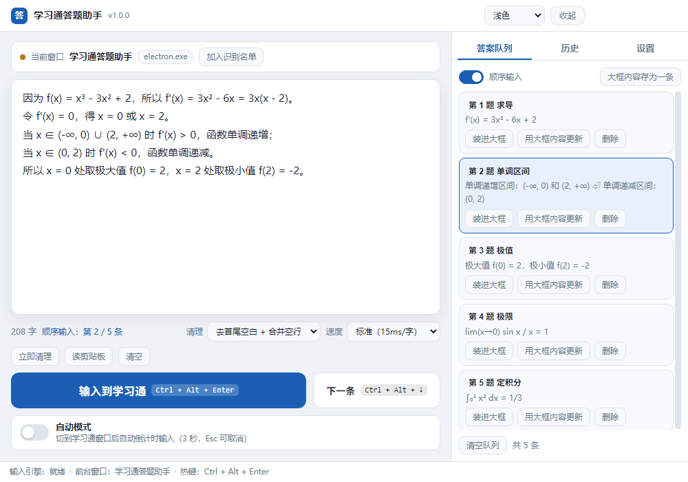
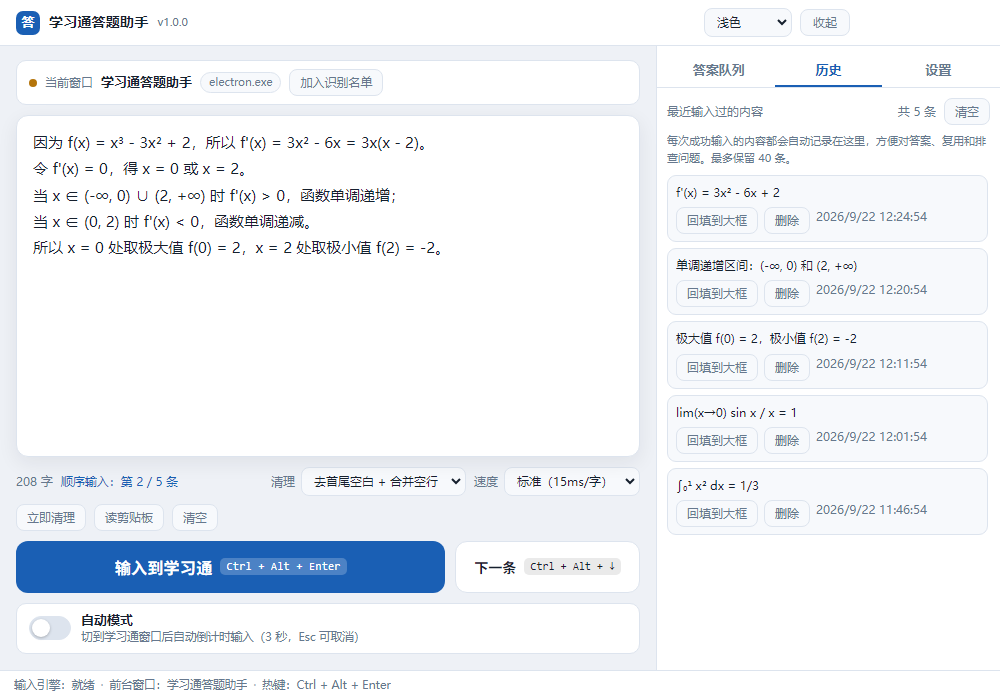
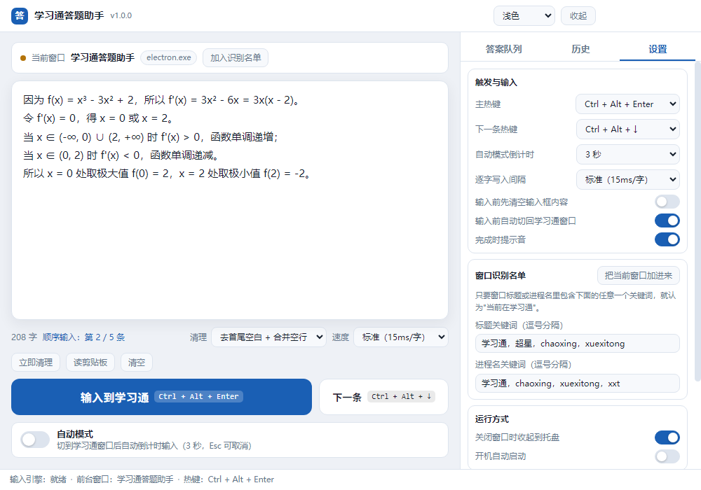
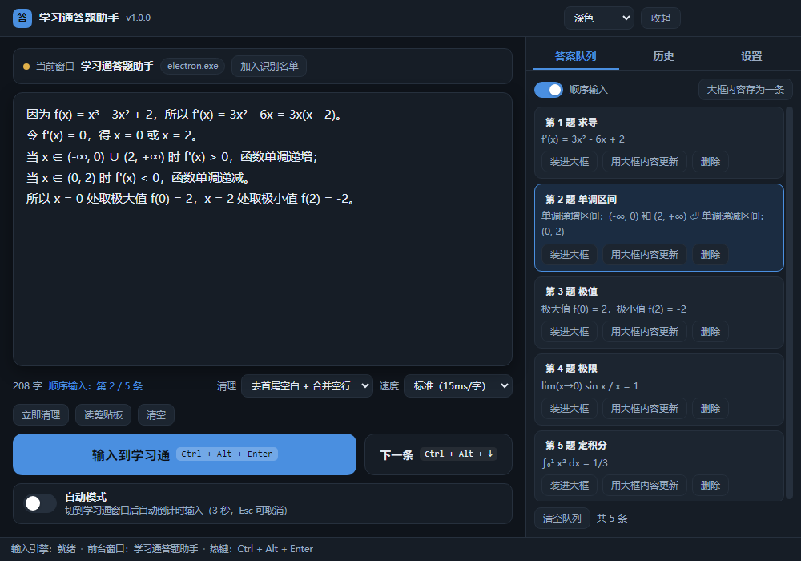

# 学习通答题助手 · StudyAnswerHelper

> 左边一个大框，答案写进去；切到学习通，按一下热键，答案就自己一个字一个字"打"进答题框。
>
> A big input box for your answers. Switch to Xuexitong (Chaoxing), press one hotkey, and the answer types itself into the answer field character by character.

**[中文说明](#中文说明) ｜ [English](#english)**



<details>
<summary><b>更多界面截图（点开看：历史记录 / 设置 / 深色主题）</b></summary>

**输入历史** —— 每次成功输入的内容自动留档，可一键回填



**设置** —— 热键、自动模式倒计时、逐字速度、窗口识别名单



**深色主题** —— 跟随系统，或手动切换



</details>

---

## 中文说明

### 这是什么

一句话：**把"复制 → 切窗口 → 点输入框 → 粘贴 → 检查"这一串动作，压缩成"写一次答案 + 按一个键"。**

它的使用场景是：需要把**同一批答案**反复、大量地录入到学习通的答题框里。手工操作时每道题都要重复 5 遍动作，几十道题下来手指和注意力都废了。这个工具把答案先放在一个大输入框里，之后每次只需要按一下热键。

### 和参考项目有什么不同

参考项目 [Z-MiCTrue/Auto_Stuendt](https://github.com/Z-MiCTrue/Auto_Stuendt) 走的是**屏幕截图 + 模板匹配 + 模拟鼠标点击**的路线。这条路线的代价是：

- 要自己准备图标截图放进 `templates/` 文件夹
- 要按自己的屏幕分辨率手改 `params.txt`
- 分辨率或界面样式一变就失效，得重新截图调参

本项目**不做屏幕识别**，改为两条更稳的路径：

| | 参考项目 | 本项目 |
|---|---|---|
| 定位方式 | 图像模板匹配 | 读窗口标题 / 进程名（Win32 API） |
| 触发方式 | 定时轮询 + 模拟点击 | 全局热键，或切到学习通后自动倒计时 |
| 受分辨率影响 | 会，换屏幕要重调参数 | 不会 |
| 输入中文 / 数学符号 | 靠剪贴板或 `pyautogui` 打字 | `SendInput` + `KEYEVENTF_UNICODE`，√ ≈ π ∫ 等直接送进输入框 |
| 界面 | 改配置文件 | 图形界面，点几下就能用 |

### 功能

- **大输入框**：整个左半屏都是输入区，可以直接 `Ctrl+V` 粘贴整段答案，自动保存草稿（关掉程序也不丢）
- **全局热键触发**：默认 `Ctrl + Alt + Enter`，在**任何**窗口下都生效，不需要先点回本程序
- **自动模式**：打开开关后，只要切到学习通窗口，倒计时 3 秒就自动输入（按 `Esc` 随时取消）
- **答案队列 + 顺序输入**：把多道题的答案预存成队列，每按一次 `Ctrl + Alt + ↓` 自动装下一条，适合连着一大批题往下录
- **逐字输入**：一个字一个字送进目标输入框，模拟真人打字节奏；速度可调（5～60 ms/字）
- **数学符号完整支持**：基于 `KEYEVENTF_UNICODE`，不走剪贴板，**不会污染你的剪贴板**，`√ ≤ ≥ π ∫ ∑ ∈ ≈ ≠ ° ∠` 都能正确输入
- **内容清理**：一键去掉首尾空白、合并多余空行和行内空格（从别处复制来的答案经常带一堆多余空白）
- **输入历史**：每次成功输入的内容自动记录，随时回填再用；同时也是一个排查问题的凭据
- **窗口识别名单可配置**：默认认「学习通 / 超星 / chaoxing / xuexitong」，如果学校用的是别的客户端，点一下"加入识别名单"把当前窗口加进去就行
- **托盘常驻**：关闭窗口不退出，缩在系统托盘里随时待命；双击托盘图标回来
- **浅色 / 深色主题**，跟随系统

### 下载与安装

到本仓库的 [Releases](../../releases) 页面下载，两个文件选一个：

| 文件 | 说明 |
|---|---|
| `StudyAnswerHelper-Setup-1.0.0.exe` | **安装版（推荐）**。双击安装，会建桌面和开始菜单快捷方式，卸载时保留你的答案数据 |
| `StudyAnswerHelper-Portable-1.0.0.exe` | **便携版**。免安装，双击即用，适合放在 U 盘里 |

> **Windows 会弹"已保护你的电脑"（SmartScreen）**
> 这是正常的：本程序没有购买代码签名证书（一年几百到几千元），Windows 对没有签名的程序一律拦一下。
> 点「更多信息」→「仍要运行」即可。源码完全公开在本仓库，可以自己核对、自己编译。

### 快速上手

1. 打开程序，把答案写进左边的大框里（或者 `Ctrl+V` 粘贴）
2. 切到学习通，**把光标点进答题框**
3. 按 `Ctrl + Alt + Enter` —— 答案会自己一个字一个字输进去

就这三步。之后每次只需要改一改大框里的内容，重复第 2、3 步。

### 三种触发方式，按习惯挑一个

| 方式 | 怎么用 | 适合 |
|---|---|---|
| **全局热键** | 光标在答题框里，按 `Ctrl + Alt + Enter` | 最常用。人在学习通界面上，手不用离开键盘 |
| **自动模式** | 打开左下角"自动模式"开关，之后只要切到学习通窗口就自动输 | 题目多、要反复切窗口；倒计时期间按 `Esc` 可取消 |
| **点按钮** | 点界面上的「输入到学习通」 | 想先确认一下内容对不对再输 |

### 常见问题

**Q：按热键没反应？**
多半是热键被别的软件占用了（很多截图/输入法软件会占用 `Ctrl+Alt+*`）。到「设置 → 主热键」换一个，界面上会提示是否注册成功。

**Q：程序显示"已输入"，但学习通里什么都没出现？**
最可能的原因是**权限不对等**。Windows 有 UIPI 保护机制：**普通权限的程序无法向以管理员身份运行的窗口发送按键**。
如果你用的是以管理员身份启动的浏览器，或者学习通客户端本身以管理员运行，请把本助手也改成"以管理员身份运行"。

其他可能：
- 光标没有落在答题框里（先点一下答题框）
- 学习通页面还没加载完
- 某些答题框是特殊编辑器（富文本/公式编辑器），对模拟按键不敏感 —— 这种情况把「逐字写入间隔」调大一些（设置里选"很稳（60ms/字）"）通常能解决

**Q：输入的内容被截断了 / 有几个字丢了？**
把「逐字写入间隔」调大。设置为"稳妥（30ms/字）"或"很稳（60ms/字）"。默认 15ms 已经能适配绝大多数答题框，但页面越卡就越需要放慢。

**Q：为什么不用剪贴板粘贴？那样快得多。**
因为剪贴板粘贴会**覆盖你剪贴板里原有的内容**，而且有些答题框对 `paste` 事件做了拦截。逐字输入不会动剪贴板，也最接近真人操作。

**Q：识别不到学习通窗口？**
默认名单是按学习通官方客户端和网页版配的。如果学校用的是定制客户端，切到那个窗口，点界面上「加入识别名单」按钮，把它的标题和进程名加进去即可。

**Q：数据存在哪？**
`%APPDATA%\学习通答题助手\answer-data.json`（纯文本 JSON，可以直接看、可以备份）。
点「设置 → 打开数据文件夹」直接跳过去。卸载时不会删除这个文件。

**Q：杀毒软件报毒？**
Electron 应用 + 全局键盘钩子 + 模拟按键，这几个特征叠加起来很容易触发启发式误报。源码全部公开，可自行审计或自行编译（见下文）。

### 技术实现

```
Electron 主进程 ──IPC──> 渲染进程（界面）
      │
      └── fork 子进程 ──> koffi(FFI) ──> Win32 API
                                        ├─ GetForegroundWindow / GetWindowTextW  读前台窗口
                                        ├─ QueryFullProcessImageNameW            读进程名
                                        └─ SendInput + KEYEVENTF_UNICODE         逐字输入
```

几个刻意的设计决定：

- **不用 `pyautogui` / `robotjs`**：`koffi` 是预编译的 N-API 模块，装完即用，不需要本机编译工具链，也不受 Node 版本升级影响。
- **逐字输入丢进独立子进程**：`SendInput` 逐字发送时是阻塞的（每个字之间要 sleep），放在主进程会卡死界面。所以单独 fork 一个进程专门干这件事，通过 IPC 通信，界面始终流畅。
- **手写 `INPUT` 结构体而不是用结构体绑定**：`sizeof(INPUT)` 在 x64 下是 40 字节，偏移是固定的。直接按字节写 Buffer 比让 FFI 去做结构体封送更可控，也更快。仓库里的 `tools/probe-koffi.js` 就是这个假设的自检探针。
- **提醒一个真实的坑**：`koffi` 把 `void*` 返回值（比如窗口句柄）返回成 **BigInt**，而 Node 的 IPC 默认用 JSON 序列化，`JSON.stringify(BigInt)` 会**直接抛异常**。如果这个异常被 `try/catch` 吞掉，表现就是"前台窗口永远读不到、输入完成收不到回执"——非常隐蔽。本项目在读取处统一转成 `Number`，并在发送处做了降级兜底。

### 从源码运行 / 构建

需要 Node.js 18+。

```bash
# 1. 安装依赖
npm install

# 2. 开发模式运行
npm start
# 如果启动失败（沙箱/GPU 环境受限），用：
npm run start:safe

# 3. 生成图标（改过 tools/make-icons.js 之后执行）
npm run icons

# 4. 打包成 exe（产物在 dist-installer-v1/）
npm run build
```

国内网络建议先设镜像（`.npmrc` 已经配好了）：

```bash
npm config set registry https://registry.npmmirror.com
```

> 重复打包时建议换一个输出目录，免得清理旧目录失败：
> `npx electron-builder --win --config.directories.output=dist-installer-v2`

### 上传到你自己的 GitHub 仓库

`release/` 目录里就是打包好的成品，三种上传方式任选。

**先看清楚这条**：GitHub 对单个文件有两条硬规定 —— 超过 **50 MB** 会警告，超过 **100 MB** 直接拒绝。本项目两个 exe 各约 **76 MB**，能提交上去，但仓库会变得很重，而且以后每次改代码重新提交都会在历史里再存一份。

**方式一：源码走仓库 + 二进制走 Releases（推荐）**

仓库里只放源码，exe 作为 Release 附件发布，不占仓库体积，下载体验也更好：

```bash
git init
git add .
git commit -m "学习通答题助手 v1.0.0：源码"
git branch -M main
git remote add origin https://github.com/<你的用户名>/<仓库名>.git
git push -u origin main

# 再发布 Release（需要先安装 GitHub CLI：https://cli.github.com/）
gh release create v1.0.0 \
  "release/StudyAnswerHelper-Setup-1.0.0.exe" \
  "release/StudyAnswerHelper-Portable-1.0.0.exe" \
  "release/使用说明.txt" \
  --title "学习通答题助手 v1.0.0" \
  --notes "首次发布"
```

README 里的下载链接用的是相对路径 `../../releases`，所以走 Releases 时链接直接就通。

**方式二：exe 也一起提交（简单，但仓库会变重）**

```bash
git init
git add .            # release/ 不在 .gitignore 里，会被一起提交
git commit -m "学习通答题助手 v1.0.0（含 exe）"
git branch -M main
git remote add origin https://github.com/<你的用户名>/<仓库名>.git
git push -u origin main
```

> 如果 push 时报 `this exceeds GitHub's file size limit of 100 MB`，说明文件太大，改用方式一。
> 如果 push 很慢或失败，多半是网络问题，可以配代理：
> `git config --global http.proxy http://127.0.0.1:7890`

**方式三：两个都要**

仓库里放源码 + 一份 exe，同时再发一个 Release。适合想让别人 clone 下来就能直接用的场景。

### 自动化自检

这个项目配了三套自动验证，改完代码建议跑一遍：

| 环境变量 | 作用 |
|---|---|
| `SP_SELFTEST=1` | **交互级自检**：在真实渲染进程里断言 20 项，包括用 `elementFromPoint` 验证"按钮是不是真的点得到"（程序化 `click()` 会绕过层级遮挡判定，掩盖真实缺陷） |
| `SP_SMOKE=1` | **真实键盘注入**：开一个标题为「学习通」的测试窗口，用真正的 `SendInput` 把 `数学答案：√3 + 1/2 ≈ 1.366` 打进去，再读回来逐字比对 |
| `SP_SHOT=1` | **界面截图走查**：把三个页面 × 两套主题截成 PNG 放到 `preview/` |

v1.0.0 打包产物的实测结果（开发态与打包后的 exe 各跑一遍，结果一致）：

```
SP_SELFTEST   20 项通过 / 0 项失败 / 0 个渲染层 JS 错误
SP_SMOKE       5 项通过 / 0 项失败
              窗口识别命中 → 键盘注入完全一致（21 字 / 465 ms）
```

```bash
# Windows / PowerShell
$env:ELECTRON_RUN_AS_NODE = $null      # 必须清掉，否则 electron 会以纯 Node 模式启动
$env:SP_SMOKE_LOG = "$PWD\_smoke.log"  # 让日志落到文件（部分终端拿不到 stdout）
$env:SP_SMOKE = "1"
.\node_modules\electron\dist\electron.exe . --no-sandbox --disable-gpu
```

### 数据与隐私

- **完全离线**。程序不联网，不发任何请求，没有埋点，没有账号体系。
- 你的答案只存在本机 `%APPDATA%\学习通答题助手\answer-data.json` 里。
- 程序不使用剪贴板，只读取前台窗口的**标题和进程名**用于判断"是不是学习通"，不读取窗口内容、不截屏、不记录按键。

### 免责声明

本工具的作用是**减少重复性的手工录入操作**，本身不产生内容、不提供答案、不绕过任何考试或作业机制。它替代的是你的手，不是你的判断。

请在你**有权录入内容**的场景下使用（例如教师录入标准答案、录入自己已完成的答案、整理教学材料）。请遵守你所在学校关于学习平台的使用规定。使用者需自行承担因使用不当而产生的全部后果。

### 开源协议

[MIT](LICENSE)

---

## English

### What it is

**It compresses "copy → switch window → click the field → paste → verify" into "write the answer once, then press one key".**

The use case: repeatedly entering the same set of answers into Xuexitong (Chaoxing) answer fields, at volume. Done by hand that is five actions per question — across dozens of questions your hands and your attention are gone. This tool keeps the answer in one large text box, and after that each entry costs a single keystroke.

### How it differs from the reference project

The reference project [Z-MiCTrue/Auto_Stuendt](https://github.com/Z-MiCTrue/Auto_Stuendt) uses **screenshot templates plus template matching and synthetic mouse clicks**. The cost of that approach:

- You must capture icon screenshots yourself and drop them into `templates/`
- You must hand-edit `params.txt` for your own screen resolution
- Change the resolution or a UI style and it breaks until you re-tune everything

This project does **no screen recognition**. It takes two sturdier routes instead:

| | Reference project | This project |
|---|---|---|
| Targeting | Image template matching | Window title / process name via Win32 API |
| Trigger | Timed polling + synthetic clicks | Global hotkey, or a countdown after switching to Xuexitong |
| Resolution sensitive | Yes, retune per screen | No |
| CJK / math symbols | Clipboard or `pyautogui` typing | `SendInput` + `KEYEVENTF_UNICODE` — `√ ≈ π ∫` go straight into the field |
| Interface | Edit a config file | GUI, a few clicks |

### Features

- **Large input box** — half the window is the input area. Paste a whole answer with `Ctrl+V`; the draft is auto-saved and survives a restart.
- **Global hotkey** — default `Ctrl + Alt + Enter`, works from **any** window, no need to click back into this app first.
- **Auto mode** — flip the switch and simply switching to the Xuexitong window starts a 3-second countdown and then types. Press `Esc` to cancel.
- **Answer queue with sequential entry** — pre-store answers for many questions; each press of `Ctrl + Alt + ↓` loads the next one. Built for working through a long list.
- **Character-by-character typing** at a human-like pace. Speed is adjustable (5–60 ms per character).
- **Full math symbol support** — built on `KEYEVENTF_UNICODE` rather than the clipboard, so it **never clobbers your clipboard**, and `√ ≤ ≥ π ∫ ∑ ∈ ≈ ≠ ° ∠` all arrive intact.
- **Text cleanup** — one click to trim leading/trailing whitespace and collapse redundant blank lines and inline spaces (pasted answers are usually full of stray whitespace).
- **Input history** — every successful insertion is recorded and can be refilled with one click. It doubles as a diagnostic trail.
- **Configurable window matching** — defaults to `学习通 / 超星 / chaoxing / xuexitong`. Using a different client? Switch to its window and click "Add current window to match list".
- **Lives in the tray** — closing the window keeps the app running in the system tray; double-click the tray icon to bring it back.
- **Light / dark theme**, following the system setting.

### Download and install

Grab one of the two files from this repository's [Releases](../../releases) page:

| File | Description |
|---|---|
| `StudyAnswerHelper-Setup-1.0.0.exe` | **Installer (recommended).** Creates desktop and Start Menu shortcuts. Your answer data is kept when you uninstall. |
| `StudyAnswerHelper-Portable-1.0.0.exe` | **Portable.** No installation, run it straight from a USB stick. |

> **Windows SmartScreen will warn you.** This is expected: the app is not code-signed (a certificate costs hundreds to thousands per year), and Windows blocks unsigned binaries by default. Click "More info" → "Run anyway". The full source is in this repository — audit it, or build it yourself.

### Quick start

1. Open the app and write your answer into the large box on the left (or paste with `Ctrl+V`).
2. Switch to Xuexitong and **click the caret into the answer field**.
3. Press `Ctrl + Alt + Enter` — the answer types itself in, character by character.

That's it. Afterwards just edit the box and repeat steps 2–3.

### Three ways to trigger it

| Method | How | Best for |
|---|---|---|
| **Global hotkey** | With the caret in the answer field, press `Ctrl + Alt + Enter` | The everyday case — you stay on the Xuexitong screen, hands never leave the keyboard |
| **Auto mode** | Flip "Auto mode" on; from then on switching to the Xuexitong window types automatically | Long question lists and constant window switching. `Esc` cancels during the countdown |
| **Button** | Click "输入到学习通" in the UI | When you want to eyeball the content first |

### FAQ

**The hotkey does nothing.**
Most likely another app already owns it (screenshot and IME utilities love `Ctrl+Alt+*`). Change it under Settings → Main hotkey. The UI tells you whether registration succeeded.

**The app says it typed, but nothing appears in Xuexitong.**
Most likely an **integrity-level mismatch**. Windows enforces UIPI: **a normal-privilege process cannot send keystrokes to a window running elevated.** If your browser or the Xuexitong client runs as administrator, run this helper as administrator too.

Other possibilities: the caret is not in the answer field (click it first); the page has not finished loading; or the field is a rich-text/formula editor that ignores synthetic keys — in that case raise the typing interval to "稳妥 (30 ms)" or "很稳 (60 ms)".

**Typed text is truncated or some characters are missing.**
Raise the typing interval. 15 ms handles the vast majority of fields, but the laggier the page, the slower you should go. Settings → 逐字写入间隔.

**Why not just paste from the clipboard? It is far faster.**
Clipboard pasting **overwrites whatever was in your clipboard**, and many answer fields intercept the `paste` event. Character-by-character input touches nothing and is the closest thing to a human at the keyboard.

**It does not recognise my Xuexitong window.**
The default list covers the official client and web version. For a school-specific client, switch to that window and click "Add current window to match list".

**Where is my data?**
`%APPDATA%\学习通答题助手\answer-data.json` — plain JSON, readable and backup-friendly. Settings → "Open data folder" jumps there. Uninstalling keeps the file.

**My antivirus flags it.**
An Electron app plus global keyboard hooks plus synthetic input is a textbook combination for heuristic false positives. The source is entirely open — audit it, or build it yourself.

### How it works

```
Electron main process ──IPC──> renderer (UI)
      │
      └── fork child process ──> koffi (FFI) ──> Win32 API
                                                 ├─ GetForegroundWindow / GetWindowTextW  read foreground window
                                                 ├─ QueryFullProcessImageNameW            read process name
                                                 └─ SendInput + KEYEVENTF_UNICODE         type characters
```

A few deliberate choices:

- **Not `pyautogui` / `robotjs`.** `koffi` ships prebuilt N-API binaries: install and go, no local toolchain, no breakage on Node upgrades.
- **Typing runs in a separate child process.** `SendInput` with a per-character delay blocks, which would freeze the UI if it ran in the main process. So it lives in its own forked process and talks over IPC; the UI stays responsive.
- **The `INPUT` struct is hand-packed rather than FFI-marshalled.** `sizeof(INPUT)` is 40 bytes on x64 with fixed offsets; writing the buffer directly is more predictable and faster. `tools/probe-koffi.js` is the probe that verifies those assumptions.
- **One real trap worth knowing:** `koffi` returns `void*` values (window handles) as **BigInt**, and Node's IPC serializer uses JSON, where `JSON.stringify(BigInt)` **throws**. Swallowed by a `try/catch`, the symptom is "foreground window never detected, insertion receipt never arrives" — extremely hard to spot. This project normalises to `Number` at the read site and adds a fallback at the send site.

### Build from source

Requires Node.js 18+.

```bash
npm install          # install dependencies
npm start            # run in development
npm run start:safe   # if the sandboxed/GPU-restricted environment fails to start
npm run icons        # regenerate icons after editing tools/make-icons.js
npm run build        # package into an exe (output in dist-installer-v1/)
```

> For repeat builds, use a fresh output directory to avoid a failed cleanup of the old one:
> `npx electron-builder --win --config.directories.output=dist-installer-v2`

### Publishing to your own GitHub repository

The finished binaries are in `release/`. Pick one of three routes.

**Read this first.** GitHub enforces two hard limits per file: a warning above **50 MB** and a hard rejection above **100 MB**. Each exe here is about **76 MB** — it will commit, but the repository gets heavy, and every future rebuild adds another copy to history.

**Route 1 — source in the repo, binaries in Releases (recommended)**

```bash
git init
git add .
git commit -m "StudyAnswerHelper v1.0.0: source"
git branch -M main
git remote add origin https://github.com/<your-name>/<repo>.git
git push -u origin main

# then publish a release (requires the GitHub CLI: https://cli.github.com/)
gh release create v1.0.0 \
  "release/StudyAnswerHelper-Setup-1.0.0.exe" \
  "release/StudyAnswerHelper-Portable-1.0.0.exe" \
  "release/使用说明.txt" \
  --title "StudyAnswerHelper v1.0.0" \
  --notes "First release"
```

The download links in this README use the relative path `../../releases`, so they work out of the box with this route.

**Route 2 — commit the exes too (simplest, but a heavy repo)**

```bash
git init
git add .            # release/ is not gitignored, so the exes are included
git commit -m "StudyAnswerHelper v1.0.0 (with binaries)"
git branch -M main
git remote add origin https://github.com/<your-name>/<repo>.git
git push -u origin main
```

> If the push fails with `this exceeds GitHub's file size limit of 100 MB`, switch to route 1.
> If the push is slow or fails outright it is usually the network — try `git config --global http.proxy http://127.0.0.1:7890`.

**Route 3 — both.** Ship the source plus one exe in the repo, and also cut a Release.

### Automated verification

Three self-check harnesses ship with the project. Run them after touching the code:

| Env var | What it does |
|---|---|
| `SP_SELFTEST=1` | **Interaction-level self-test**: 20 assertions inside the real renderer, including `elementFromPoint` hit-testing for "can the user actually click this?" — programmatic `click()` bypasses stacking order and hides real defects. |
| `SP_SMOKE=1` | **Real keystroke injection**: opens a test window titled "学习通" and types `数学答案：√3 + 1/2 ≈ 1.366` with actual `SendInput`, then reads it back and compares character for character. |
| `SP_SHOT=1` | **Visual walkthrough**: captures three pages × two themes into `preview/` as PNGs. |

Measured on the v1.0.0 artifacts (development tree and the packaged exe, same results):

```
SP_SELFTEST   20 passed / 0 failed / 0 renderer JS errors
SP_SMOKE       5 passed / 0 failed
              window matched → keystroke injection byte-identical (21 chars / 465 ms)
```

```powershell
$env:ELECTRON_RUN_AS_NODE = $null      # must be cleared, or Electron boots as plain Node
$env:SP_SMOKE_LOG = "$PWD\_smoke.log"  # write logs to a file (some terminals swallow stdout)
$env:SP_SMOKE = "1"
.\node_modules\electron\dist\electron.exe . --no-sandbox --disable-gpu
```

### Data and privacy

- **Fully offline.** No network calls, no telemetry, no accounts.
- Your answers live only in `%APPDATA%\学习通答题助手\answer-data.json` on your own machine.
- The app never uses the clipboard. It reads only the **title and process name** of the foreground window to decide "is this Xuexitong?" — never window contents, never screenshots, never keystrokes.

### Disclaimer

This tool exists to **cut down repetitive manual entry**. It generates no content, supplies no answers, and circumvents no exam or assignment mechanism. It replaces your hands, not your judgement.

Use it where you **have the right to enter the content** — a teacher entering reference answers, entering answers you have already worked out yourself, or organising teaching material. Follow your institution's rules for its learning platform. Users bear full responsibility for any consequences of misuse.

### License

[MIT](LICENSE)
